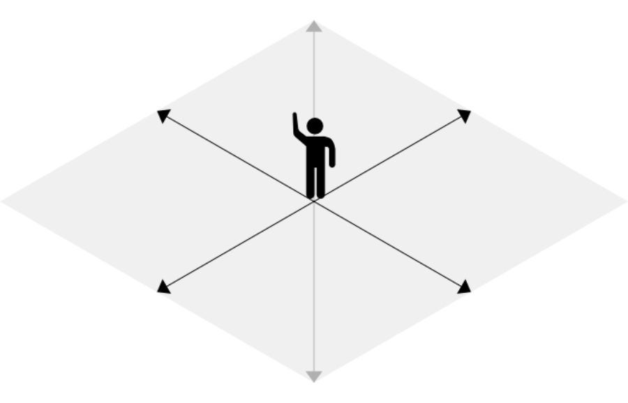
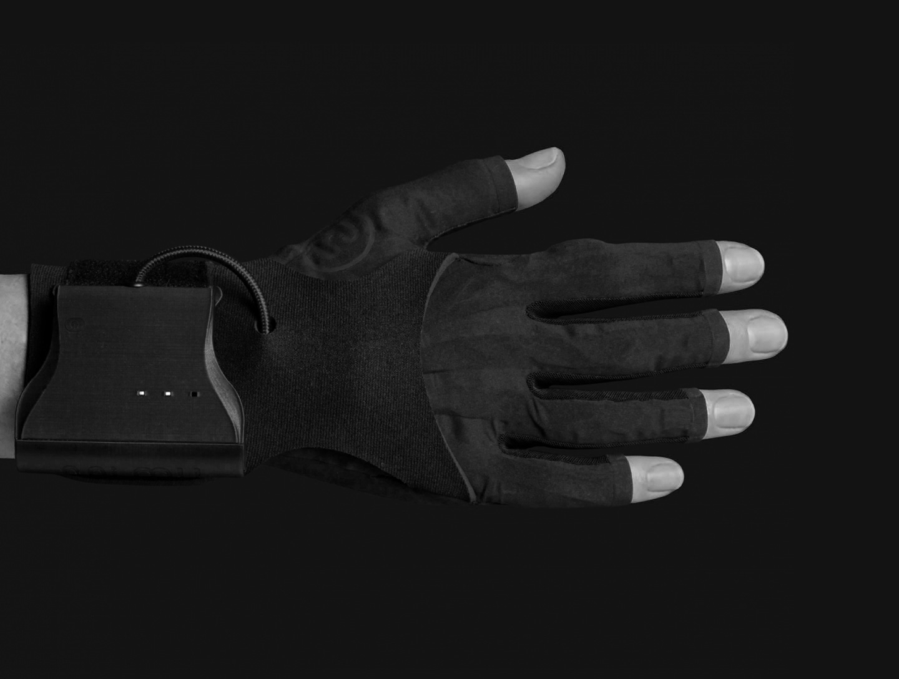
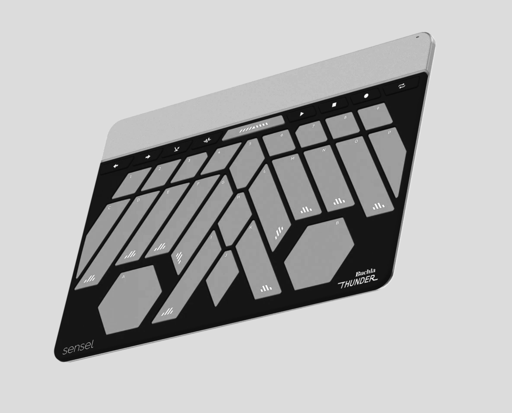

## INTRODUCTION

Let's begin by watching a brief video, an étude of sorts that explores two relationships: the first between two processes, that of creating and that of performing; and the second between music/sound and dance.



We'll return to this video toward the end of this essay, but for now, let's imagine a performer on stage...

She or he will necessarily move in one of three directions (front-back, up-down, left-right), a movement that is spurred by a specific **desire** (regardless of the artwork, dance piece or play, whether it’s improvised, or tightly scripted, its style, etc.) This desire is intricately related to:

- The objective of the work: whatever it is that's revealed after it’s completed.
- The emotional and psychological state of both the character being played and the performer’s own self; the emotional and psychological subtext of the “story” itself (I put “story” in quotes because some works are not necessarily narrative, or the narratives are not necessarily linear – still, an idea has to come across from the presentation itself to everyone who is witnessing it).
- The imaginary function of the gesture in question that's being performed.

One could expand on this idea of gesture & image, with the hopes of finding some common ground: there is a gesture in the bowing of a string in a cello; there’s obviously a gesture in a choreographed movement of a limb as it splits the air across; a melodic line also carries some kind of curve; there’s gesture also in a line of text:


Lo, in the orient when the gracious light 
Lifts up his burning head...
    
    – Shakespeare’s Sonnet No. 7.
    


Whatever the phrase is or wherever it comes from, it will carry some quality with it, for example: a heavy heart, the levity of joy, crossing muddy waters, going against the current, playing a staccato sequence of sharp, vertical percussive hits, etc. It will also carry some kind of intensity, and most likely partake in a duality of sorts (slow / fast, high / low, superficial / deep, simple / complex, busy / empty, etc.).

What if sounds and music can resonate not only physically, but also in the imagination of the scenic work that unfolds? Could one adopt these ideas and have them inform the creation – and performance – of say a sound texture? **Could this sonic texture then be assimilated with the other gestures being performed on stage**? Could we create, not a piece of music that “accompanies” or “plays nicely with” a scenic work (or its opposite, a choreography that is "carefully set to music”), but an ecosystem instead, made of a symbiotic relationship between the two? Most often, I think this happens nonetheless, even if both elements (stage work & music) have disparate origins: the creative process is unifying by nature, anyway. But what if the dancer – first gets inspired by the rhythm and the beat, as she or he flings her or his body across the stage — and then, the music moves right along with the performer, waiting for her/him, just as an orchestra waits for the opera singer in a recitativo: the two movements (orchestra & singer / live music & dancer) become one and the poetic image in question is lit up by the combustion between the two.

## THE PHILOSOPHY BEHIND LIVE SOUND DESIGN & THE SCENIC ARTS

With a few exceptions, I would say that I don’t really have any technical background or know-how about the making of a dance work, but I have worked closely for a number of years with actors that have focused on physical theater. Throughout my years working with them, three general ideas were born:

1. **A musical and sonic landscape should be reactionary and spontaneous, open to the present timing of a particular performance**. For example, when two actors partake in some *repartee*, a scene only comes alive as the two minds and hearts become alert to the present and allow the silence between the lines to inform their pace. In contrast, most theater or dance works I’ve seen (and even worked on), rely - for practical reasons for the most part - in some kind of recorded material for sonic/musical support. Part of this reality we have to learn to deal with, as so many constraints might arise when working on a show (finances, the distance between collaborators, etc.) Still, if we are to rely on recorded material (because it does offer a whole lot of benefits nonetheless, like constancy and reliability), could we make these recordings come alive somehow? Could the sound/music person, in charge of the audio portion of a show, afford the freedom and flexibility of playing with the rhythmic pace and intensity of the sounds being played, almost as much (if not *just* as much) as the performers themselves? Could we break these recordings down into elements and play, as it were, an ‘ensemble’ of sounds with specific pace and dynamics? This would open up the landscape to really work along with actors and dancers, but also musicians on stage. By sounds, in this particular case, I’m referring to the mainstream ways of using technology for the purpose: with a laptop and some kind of software, be it some version of Q-Lab, or a digital audio workstation, a combination of samplers and synthesizers, etc. (we could add to this equation the old thunder machine, but that points to the practical challenges in question: it’s a lot easier for a sound person to carry a whole ‘orchestra’ on a laptop – of course, if the budget permits, by all means let's use a real orchestra and a room full of sound toys for the purpose! The challenge in this case is to make the technology just as powerful and malleable).

2. I still believe that it is possible to have computers serve as artistic instruments which can have an organic and warm quality to them (the following is, of course, a generalization, but it’s easy to associate digital art as being ‘cold,’ ‘all but too precise,’ ‘square,’ etc.), **inasmuch as they have the potential to be multi-dimensional instruments**. By nature, a computer is dualistic, it’s a highly complex calculator that just turns switches on or off, we usually think of them as ‘made up of 1’s and 0’s.’ But when you combine a series of these 1’s and 0’s, then you get a range of values, and when you combine rows upon rows of of these so-called ranges, then we arrive at the full glory of say a digital photograph, with all its shades of tones and minutiae. Here’s another thought apropos: a violin is by nature a multi-dimensional machine. There’s a bow, a body with four strings, and apparently that’s it. However, what happens in practice is the following: in the process of playing a phrase that carries some complexity with it (imagine, say the beginning of [Sibelius’ Violin Concerto](https://www.youtube.com/watch?v=06WmTl_d1FM)), the bow pulls the string and, at the same time, the player changes the attack, speed & pressure of the bow, the distance of the bow from the bridge, the bending of the finger as she or he slides from one note to another, or adds some vibrato, etc. Each one of these changes will affect the pitch, amplitude, timbre (make the sound brighter or darker), and add an element of noise to the sound. All of this happens instantaneously and without giving any of it a second thought – after many years of training, this is a kind of knowledge and dominion that happens through the body, it’s more of a feeling than a premeditated, or programmed thought: to play a phrase. Let’s now go back to the idea of the computer being able to work with a range of values: this can give us, for example, a range of luminosity of reds, or change the amplitude of an audio signal (from soft to loud), or the cutoff frequency of a filter (make a sound dark or bright). So, there’s a lot of potential behind a computer to create a diverse and dynamic gamma of tones and sounds. However, there’s a tendency – because it’s easy – for a computer to be one-dimensional, that is, to offer one type of change at a time, only. So far, most of the complexity that has been achieved with computer technology has been *pre-programmed*, or, one could say, it’s been ‘sculpted’ rather than ‘performed.’ Let’s take the example of a techno rave, or some DJ event. Modern DJs will have at their disposal two or four turntables or CD/mp3 players, perhaps a laptop or two. There are elements that have been pre-programmed (or ‘sculpted’): a general tempo, a beat, and various songs or loops with bass lines or sound effects, melodic & rhythmic textures, etc. – there’s already a whole market of produced music readily available; also, some of these DJs are producers themselves who would come up with their own source material. During an evening performance, a DJ will ‘feel’ the crowd and decide when to play a track, or get rid of the bass, only bring it back in after a certain phrase: that is to say, there’s a *performance* aspect to what they do. These two ideas of ‘sculpting’ and ‘performing’ are becoming more and more blurred as new technology arrives and as creators become more versed with programming. I would like to explore this blurred line and help define the potential behind sculpting vs. performing music with a computer.

3. As to my third thought: yes, technology might very well be the word of the age. However, I dare say, **as we assimilate all the novelty in technology** (as far as art is concerned at least), there’s an abundance of history and tradition that seems to be somewhat forgotten in the process: as much as we’re distracted by technology, almost as much as we lose our human compass (let's be thankful there *is* a [Center for Humane Technology](https://www.humanetech.com/)). Hence, my preoccupation with bringing back an emphasis on the poetic aspect of the creative process and to come up with some kind of vernacular for talking about poetics, whenever we talk technology. I wouldn’t want to kill the creative process by creating unnecessary labels, but in classical music there’s a whole Italian tradition used to give musicians indications: e.g. *crescendo*, *meno mosso*, *rallentando*, etc.; there are dictionaries of literary terms that poets and writers use, for example, what is the difference between synecdoche vs. metonymy? And I’m sure there’s a parallel in the world of dance as well (Laban comes to mind). And why should musicians and writers and dancers care? Well, I’m sure there are many an important subtlety to consider as we dig deeper into the creative process: there’s a reason these glossaries were created in the first place. Where is the parallel to all this in the world of art & technology?

## PRACTICAL SUGGESTIONS

How can we explore in concrete ways these three ideas: **live sound design**, **multi-dimensionality**, and **a kind of creative glossary for the technological arts**? The latter might very well be outside the scope of this essay, but perhaps the work proposed here can open a door and provide us with some clues. As to the first two, I have a little bit of background studying the topic and a few ideas to propose. Since I started working on these, there have been a few technologies that would allow me to experiment in the following areas:

- To be able to trigger a sound or a combination of sounds *– on stage –* at will (also to be able to turn them off).
- To change various qualities of a sound in real time *simultaneously*,  such as volume, timbre, pitch, amount of reverberation, etc.
- To mix between various sounds that together would compose a sonic element or texture (for example, in a theater scenario, if I were to play the sound of a tempest, I would have one layer with the sound of rain, a couple of additional layers with different wind intensities, perhaps another that carries thunder sounds, and so on. I would then ‘dial in’ the amount of intensity of the storm, giving way to more intense winds, or the frequency of the thunders, etc.
- To create virtual musical instruments that would respond to specific sequences of sounds. These sequences so far have proven to be of two natures: a) I get to program a specific song into a device and then be able to go through the song step by step, beat by beat; b) to sequence chords and arpeggios and switch between them while changing various other qualities of the material being played, such as the range of an arpeggio, or its speed, or the sonorities.

After doing a bit of research, I found the following three hardware controllers – widely available in the marketplace - which would serve the purposes in question (by programming interactive musical systems with them):

1. In my first experiments I used a wireless DJ controller made by Numark, called [The Orbit](https://www.numark.com/product/orbit):

It’s a hand-held device that in addition to being wireless (i.e. an actor or a musician can carry it with them on stage), it provides a multitude of buttons and an assignable knob, as well as two accelerometers. All of these can be mapped and configured for the purpose. Indeed, I was able to successfully create a system that was used for a production of Shakespeare’s *A Midsummer Night’s Dream* (more information and examples will follow, please read on for now).

2. The [MiMU Gloves](https://mimugloves.com/) have only recently been released commercially. This is a technology that has been in the making for some years now and it promises to provide a sophisticated level of gesture control.

I personally haven’t been able to try them, though it’s the system that seems most promising to me. Either they weren’t readily available or I didn’t have the budget to purchase a set. For various reasons, I would put the idea of prototyping with these on the shelf for the time being and suggest working with the third device which I’ll describe next. There's also another catch: even though it looks tempting for a dancer or performer on stage to wear this kind of technology, my experience has been (so far) that this would prove counter-productive. There’s so much technology to worry about in practice that it would distract any performer on stage from her or his main task at hand, which is *to convey the story* (something that will demand all of our being). However, if there is another person on stage who is dedicated to the musical and technical aspects and who could somehow mirror the stage performer(s), then a beautiful synchronicity can be developed.

3.  The Sensel Morph (specifically the [Thunder overlay,](https://morph.sensel.com/products/morph-with-buchla-thunder-overlay) which mimics and is inspired by the instrument of the same name developed by renown developer Don Buchla) is a relatively new addition to the list of available controllers that can offer gesture control with a high level of complexity and is a great contender, in my opinion. Even though it’s a table device (as opposed to the Orbit or the MiMU Gloves, which can move in space), it offers an unprecedented level of tactile precision and three-dimensional control, something which I’ve been longing for a long time. 

## IMPLEMENTATION

So far I’ve talked about the concept behind a phrase or gesture, I’ve also questioned the role of technology as a promising tool to create sonic gestures that would ‘mirror’ physical gestures on stage (by the way, the gestural work doesn’t have to be only literal). So, **what would this look like and sound like in practice?** What follows is a list of examples of, a) works that I’ve already done (and which would showcase some of the themes I’ve so far expounded on), and b) a few études that I’ve made for this essay (using the Sensel Morph’s Thunder). 

The following videos and audio examples will show how (computer-generated) music can relate to other media, be it actors or dancers on stage, etc. We’ll start with a video demo I did circa 2015-2016, to show my work in live sound design for a production of Shakespeare’s *A Midsummer Night’s Dream*, by NYC-based theater company, [New Place Players.](https://newplaceplayersnyc.com/) In it, you’ll get a taste of my first prototyping work using a DJ wireless controller to manage all the sounds and electronic music accompaniment for the production.






Performance video content redistributed by kind permission of New Place Players & Actors' Equity Association (US) – excerpts from their first production of Shakespeare's <i>A Midsummer Night's Dream</i> (2015). On screen: Lauren Shannon as <i>Titania</i>, Emilio Tirado as <i>Nick Bottom</i>. For a full list of company members please click <a href="https://newplaceplayersnyc.com/entertainment/#actors">here.</a>


For a more thorough overview of the sound design work I did for this production, please have a listen to the selected samples below:




A good part of this music is really rearrangements and citations inspired by <a href="https://en.wikipedia.org/wiki/A_Midsummer_Night%27s_Dream_(Mendelssohn)">Felix Mendelssohn's</a> incidental masterpiece (especially the <i>Intro</i> and <i>Epilogue</i>, the latter using a a sample from the recording by Claudio Abbado and the Berlin Philharmonic). Some of the <i>Oberon</i> sound cues also use a sample from the track <a href="https://www.youtube.com/watch?v=jvh0IMKX9Q4"><i>Lift</i></a> by Love and Rockets, from their 1998 album (titled the same).


You can also watch the following video demo reel that shows excerpts from various scenes which go along with the sound & music I made for the production:




On screen (in order of appearance): Matthew Cohn as <i>Oberon</i>; Adam Patterson as <i>Puck</i>; Flavio Gaete & Charlotte Mundy as <i>Fairies</i>; Lauren Shannon as <i>Titania</i>; Matthew Aughenbaugh, Olivia Osol, Aaron McDaniel, Craig Bacon & Heather Boaz as puppet masters; Morgan Auld as <i>Peter Quince</i> & Johnny Wall as <i>Francis Flute</i> (attendants to Titania). Musicians: Flavio Gaete, Charlotte Mundy and Nikolett Pankovits. Emilio Tirado as <i>Nick Bottom</i>. For a full list of company members please click <a href="https://newplaceplayersnyc.com/entertainment/#actors">here.</a>


For further information about this production (and my involvement with sound & music), please click [here.](https://flaviogaete.info/portfolio/projects/midsummer)

---

In the following section you’ll find new studies using a different technology: instead of the Orbit wireless controller (which featured accelerometers), I use a tactile controller, the Sensel Morph with the [Thunder Overlay.](https://morph.sensel.com/products/morph-with-buchla-thunder-overlay?variant=32565028913231)

For this new controller, I developed a music application, called **Telar** (still a work in progress). I will be using a combination of the Morph/Thunder and Telar to explore similar ideas and see how they would apply to music & dance.

## ABOUT TELAR

**Telar** is an application made for the Sensel Morph’s Thunder overlay (a modern implementation of a MIDI controller developed by renowned instrument designer [Don Buchla.](https://buchla.com/history/) Telar endows the Morph/Thunder with a dynamic mapping system that lets the performer assign specific note and gesture data to each slider and to swap complex configurations in real time.





It is in the context of this new technology then, that I’ve created a number of études that would demonstrate (albeit roughly) the potential for sonic gesture design. Please keep reading to see how various ideas in sound design and music would work in the context of a modern choreography…

---

## ÉTUDES

In the following four videos, I will be using a scene from Pina Bausch’s [Café Müller,](https://www.pina-bausch.de/en/works/complete-works/show/cafe-mueller/) which I’ll be setting to various sonic gestures or music. The idea eventually is to combine the various bits and create a complex composition that interweaves with the choreography.

## ÉTUDE NO. 1

In this first example, I play with three distinct sound elements:
1. A resonating thump.
2. A sonic texture (the sound of ‘rolling marbles’).
3. The sound of suspended string instruments.



In the scene, there are three characters:
- The main protagonist – the woman in the middle.
- Her lover – the man that holds her.
- A third 'external' element – another man that intercepts the other two and attempts to restore their balance (which is represented by the beloved man holding and embracing his lover).

Each sound in this first video mirrors (sometimes literally, sometimes figuratively) various elements of the story:
- The **resonating thump** mirrors the protagonist’s ‘first fall’ (which may mean some kind of ‘fall from grace,’ or an ‘accidental misfortune,’ etc.)
-  The **rolling marbles** create an image of tension between the ‘third element’ and the lovers.
- The **suspended strings** represent the attraction between the two lovers.




The following videos show, on the right side of the screen, an image sequence taken from the film <a href="https://en.wikipedia.org/wiki/Pina_(film)"><i>Pina</i>,</a> by Wim Wenders, which documents the work of <a href="https://en.wikipedia.org/wiki/Pina_Bausch">Pina Bausch</a> and featuring members of the <a href="https://www.pina-bausch.de/en/">Tanztheater Wuppertal.</a> This particular sequence is an excerpt from her piece <i>Café Müller</i>.


## ÉTUDE NO. 2

In the second étude, I use **the sound of white noise**, which is passed through a resonating filter – I then shift the frequencies & resonance of the filter in real time as I follow the two lovers, thus mirroring the emotional and sexual tension between the two (shifting the pitch of a sound is a helpful way to map gestures). Also note that in this example I'm keeping things rather simple, only changing two dimensions of the sound.




## ÉTUDE NO. 3

In the third étude, I introduce a musical angle to my sound design and play with various **chord arpeggios**. These chords are manipulated in real-time in the following ways:
- There are different harmonies that provide various degrees of tension and release as well as a harmonic or ‘meta’ rhythm to the overall arch of the scene.
- Each arpeggio is played within a range of frequencies and rhythms, which change according to the gestures at each stage of the drama.
- The sound itself is processed (distorted) to add sonic tension that would resonate with the emotional state of the characters.




## ÉTUDE NO. 4

For my fourth étude, I step aside from the gestural ideas momentarily to see how an actual piece of music (which would contain its own pace, emotional flow and poetic allusions) could fit with the choreography: that is, if the two ‘stories’ (song & dance) can resonate with each other. Otherwise, will there be specific elements from each that could fit together?

Also, it will be interesting to see if all the material shown so far in the four études (the **sonic gestures** and the **musical elements**), if they can be combined somehow while carrying their own essence, or if they will need to be ‘scored’ together with the various elements of the choreography.

As far as the song used for this example, it was started before these études were created and so it carries its own poetic ideas, pace, etc. It is a work in progress (in fact, the soundtrack provided is but a rough demo). As I was contemplating the chosen dance sequence, it occurred to me to juxtapose the two, as they may actually have some themes in common, beginning with the idea of the main characters (i.e. the main protagonist in the dance and the person being addressed in the song) finding some kind of peace, a restitution of balance and harmony. 

The context of the song is that the addressee has suffered some kind of emotional trauma in some recent past, and she or he is having a hard time gathering the impetus necessary to move on; they’re afraid of whatever the next move should be, afraid of making some new mistake that would hurt them again, like someone who has suffered a bicycle accident and is about to ride her or his bike again.

Following are the lyrics of the song, which are split in two parts: there’s a **spoken** element (a poem), and lyrics that are **sung** in parallel.



<h3>Spoken Text</h3>
Today, for us, is like me and my guitar. 
About three notes, 
Three stops and a few strings, 
And so many combinations.  
Like life.  
Start with one, then see... 
What happens if you let the string just ring, 
Almost on its own? 
What happens if, and when, 
You intervene?  
Just listen...  
Listen to the beating, 
The frequencies colliding, 
Listen to the beating of your own heart, 
And all that you desire. 
Should I dare eat a peach, make a sound?  
Just take care, 
And always allow that river of sound 
To carry its own 
Life 
And the healing will come.  
Now,  
What it all was, 
What it will be, 
That self-same eternal, 
A peace so complete.  

<h3>Sung Lyrics</h3> 
River, oh river, 
You, that flows endlessly, 
Dash me and my bags 
Into tiny little lights 
And let them flow endlessly, 
Too, 
A milky way. 






The still images used in this video are photographs by <a href="https://en.wikipedia.org/wiki/Henri_Cartier-Bresson">Henri Cartier-Bresson:</a> <i>Stairs</i> (date unknown) and <i>Dans un train</i> (1975). The recording is a rough demo of an original song, the narrated text being performed by <a href="https://vimeo.com/390619402">Tim Venable,</a> reproduced by kind permission of the actor.


**NOTE**: between the first writing of this essay and its current publication, this song has been somewhat finalized: even though it has yet to be mixed & mastered, the following video contains the final orchestration. The song also received a new title: *Dear Mom, Dad*.





What this last exercise has proven so far for me is that: yes, ideas that come from disparate sources but which partake anyhow in a general artistic direction can indeed be juxtaposed. This, in my opinion, opens a wide door for collaboration. And a composer and choreographer can work together and/or separately, in small or large strokes, but as long as they commit to an honest dialog while creating, they can indeed stumble on many a great surprise. This gives me hope that this work might not be in vain ultimately!

