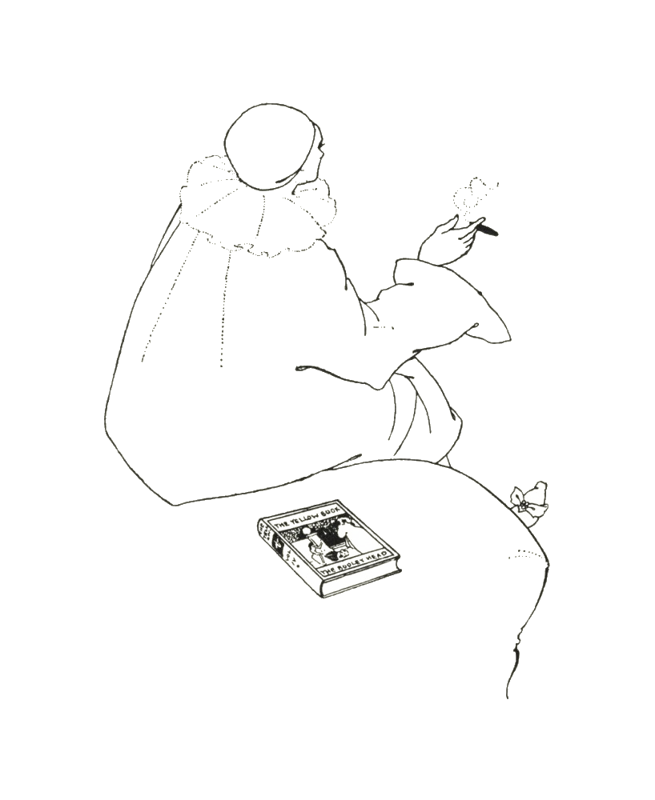
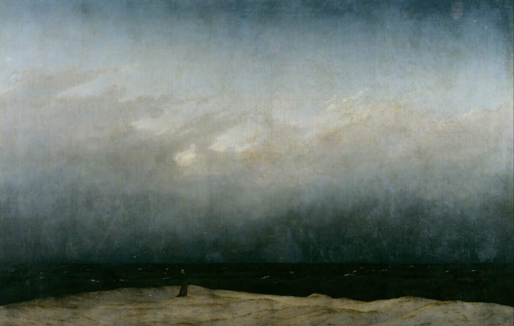

## DEAR MOM, DAD



---

## LITTLE STAR





<h3>LITTLE STAR</h3>

A veil of glass lies behind my fingertips, 
There's me inside but outside of myself there lies 
What I can't find, my precious heart.  

We're skin to skin, and yet there is no more flame in our lips, 
I break through walls, I reach out, and yet I blindly die. 
My family and all my friends so far apart,  

The sky has gone so dark, a wide eclipse.  

We'll plant a garden, 
We'll weave together 
A canopy of flowers.  

We'll fill our vaults and firmament 
With gladness and love, 
With meaning, and place for our forgotten selves.  

We'll fill our vaults and firmament, 
We'll find a place for us to be.



---

## AZUL


The Monk by the Sea, by <a href="https://en.wikipedia.org/wiki/The_Monk_by_the_Sea" target="_blank">Caspar David Friedrich.</a>






<h3>AZUL</h3>

Mar profundo, de un azul negro, negro, negro, 
Boca de lobo, agujero negro, profuso océano. 
Mis pupilas se dilatan buscando la luz. 
Mis brazos y piernas se extienden y avanzan, 
Como un canto Andaluz. 
Ellos buscan y no alcanzan, nadando en tu amplitud.  

Una y otra vez, mi corazón palpitaba 
Creciendo de anhelo en anhelo 
Y atiborrado se desbordó. 
Olas colosales retumbaban, 
Una y otra vez el Gran Deseo se estrelló 
En solemne colisión.  

Azul luminoso, te extiendes y avanzas 
Buscando la luz... 
Dichoso es quien te conozca, 
Nadando en tu amplitud.  

Mar profundo, en contraluz 
Tu amor se desenlaza. 
El universo es un vientre, 
Uno llora cuando nace. 

<h3>BLUE</h3>
Deep sea, of a black, black, black kind of blue, 
Mouth of a wolf, black hole, profuse ocean. 
My pupils expand, searching for light. 
My limbs extend themselves and move forward 
Like some Andalusian chant. 
They seek and can’t reach, swimming in your spaciousness.  

Again and again, my heart was throbbing 
Growing from one yearning to another 
And chock-full, it overflowed. 
Colossal waves rumbled, 
Again and again, the Great Desire crashed 
In solemn collision.  

Luminous blue, you extend and you advance 
Searching for the light... 
Blissful is he who knows you, 
Swimming in your spaciousness.  

Deep sea, against the light 
Your love unravels. 
The universe is a womb, 
We cry when we’re born.

