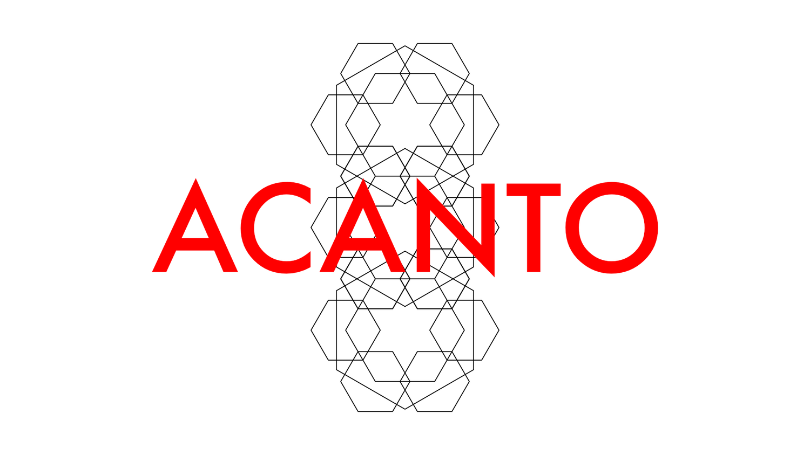
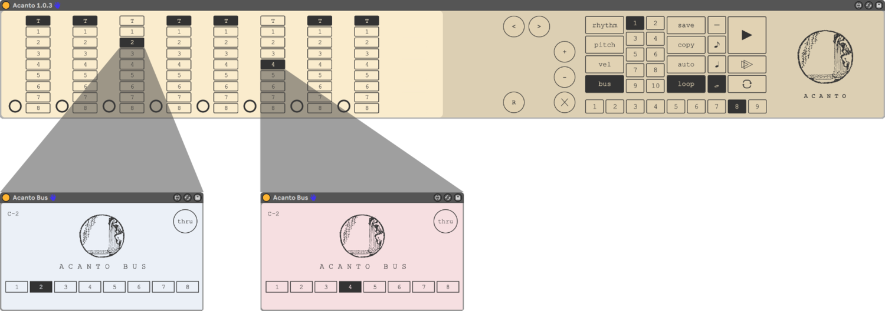
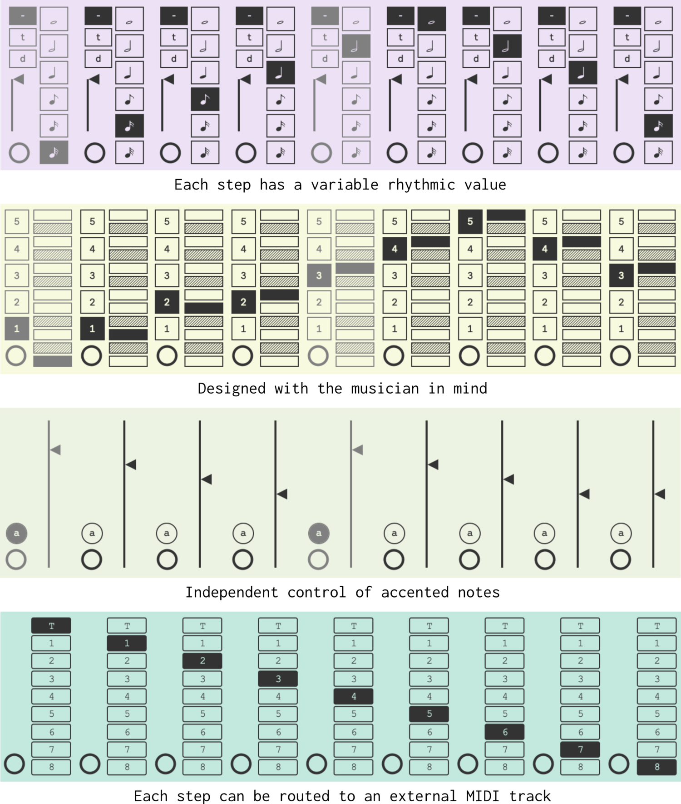
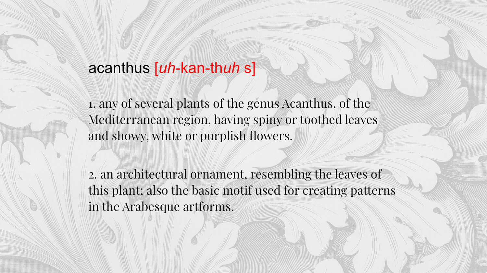




Acanto is an analog-type sequencer for Max for Live, with variable rhythmic control multi-timbral capacity. Its transport system can be completely independent from Live’s transport (of course, if you want your sequences to be quantized to a bar or beat, or an eight note, you can do that as well). Each step can have its own rhythmic value and can also be routed to an independent output, via an Acanto bus device. The inspiration behind this sequencer stems from the idea of wanting to play around with patterns and pattern formations, and in doing so to give the user more immediate and more musical interaction, so that one can feel at ease improvising and playing with ideas on the spot.




## ACANTO'S KEY FEATURES

- Its transport system can be completely independent from Live’s transport (of course, if you want your sequences to be quantized to a bar or beat, or an eight note, you can do that as well).
- Each step can have its own rhythmic value.
- Each step can also be routed to an independent output, via an Acanto bus device.

- The velocity section offers independent control of accented vs. non-accented notes.
- Each element of your sequence (rhythm, pitch, velocity, etc.) can be modified on the spot in a number of ways. For example, you can shift a particular sequence (of pitches, or rhythms, etc.) left or right, or you can increase or decrease their values proportionately –– and you can do so independently of the other elements.
- You can save up to 10 presets inside each instance of Acanto, and you can recall them via MIDI or through Live's automation system.
- In fact, almost all parameters are available to Live's mapping and automation.

---

## RESOURCES

### ONLINE COURSE

For those who speak Spanish, I have developed a small course about [Analog Sequencers & Acanto](https://flaviogaete.gumroad.com/l/curso-secuenciadores) (dur. 5 hrs.). I'm in the process of developing a parallel version in English and will post it soon.

## INSTRUCTIONAL VIDEOS





---

## SYSTEM REQUIREMENTS
Acanto was built with Max 8.1.5. & Live 10.1.18.
[License Information](/license)



