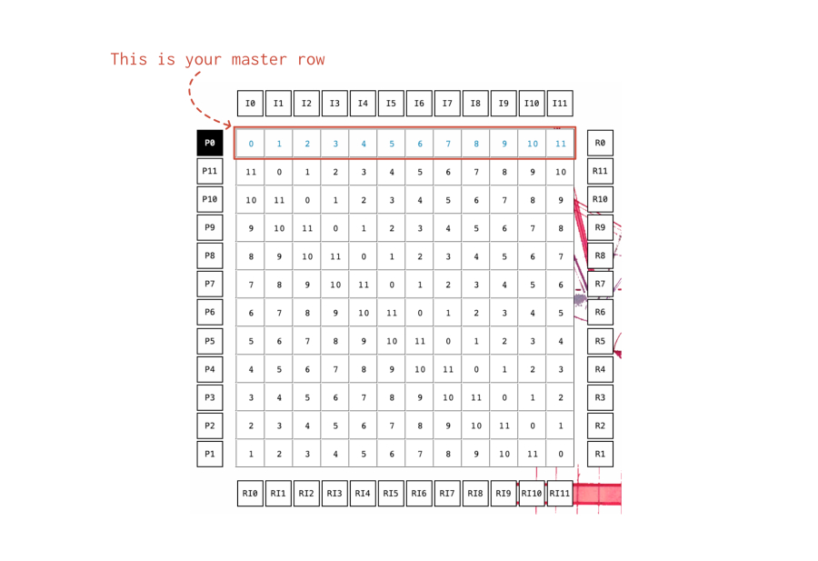




Kandinsky is a 12-tone matrix generator & player for Max for Live (soon to be published as a standalone app as well). It let's you define a 12-tone row for music composition and automatically creates a matrix of the standard row variations (primes, retrogrades, inversions and retrograde inversions). Furthermore, you can then create note groupings in order to make chords out of the series. You can also transpose each note in the series within an 8-octave range. The whole matrix and types of chord processing can be selected via MIDI and played in real time.




There are two modes of operations, Learn, which routes your MIDI keyboard to the matrix itself in order to define your master row; and Play, which lets you select the various types of inversions and retrogrades and to play the series in real time.

You can define your series by playing your MIDI keyboard, or you can type the numbers directly using the computer, or by clicking on the step input tab.

You can also use the slider if you’d like to modify any one step

Automatically, the 12-tone matrix is populated with the corresponding primes, inversions, retrogrades and retrograde inversions

Around the Matrix there are four sets of Row Selectors:

- Primes, located on the left.
- Inversions, at the top.
- Retrogrades, on the right.
- Retrograde Inversions, at the bottom.

You can click on any one ‘row inversion’ type, or you can select them via MIDI.

On the right side of the Kandinsky panel, there are five additional elements called the Row Macro Controls:

a. The Reset button: whenever you’re confused about the state of your row, or if you want to start working from a clean slate, click on this button. The row itself will be normalized to a straight numerical sequence, from 0 – 11.
b. The Random button will, as the name implies, randomize your row.
c. Towards the right of the Row Macro Controls is the Row Bank program number: you can store and recall up to 99 rows. You need to select your program number first, before you choose to store or recall.
d. Once you’ve selected a program number, you can Store the current row on that number slot, or...
e. You can also Recall a program number once it’s been saved.

On the top-right corner, you’ll find the MIDI Mapping guide. It’s divided into four sections, by octaves...

A. On first octave (C1 - D#1), you can select the type of row.
B. On the second octave (C2 - B2) you select the row itself.
C. On the third octave (C3 - B3) you choose the type of chord processing (see below).
D. On the fourth octave (C4 - B4) you get to finally play the row,

The Chord Processor is an additional matrix that allows you to “re-route” your MIDI input so that you can regroup your series in any combination of chords or note sequence.

The Global Transposition allows you to shift the ‘zero’ base of your series so it can become any other note besides c. The Octave Transposition allows you to transpose each note in your series within an 8-octave range.

The Notes Monitor, below, shows you the final row as it’s meant to be played (reflecting any the chord processing or note transpositions you may have applied to your series).

You can save all of your configurations (any rows you may have stored, and/or any chord processing or note transpositions you may created) into an external file.

---

## SYSTEM REQUIREMENTS
Kandinsky was built with Max 8.1.5. & Live 10.1.18.
[License Information](/license)


