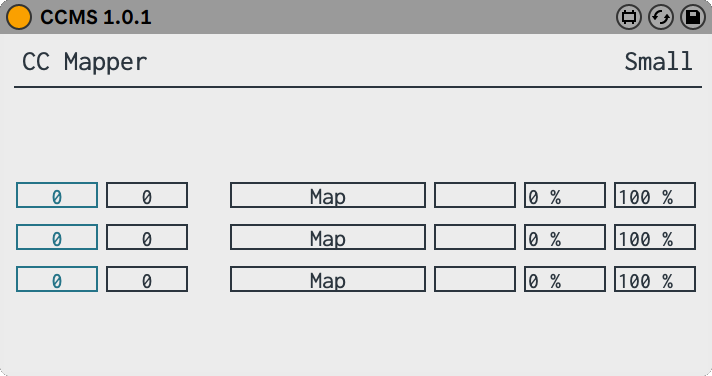



Modulo is a suite of Max for Live devices that aims at extending the DAW’s functionality as a kind of modular system itself. It’s quite humble in what it offers – there are actual modular systems out there that are quite comprehensive (on the Max side of the pond we have the great [Oscillot](https://www.ableton.com/en/packs/oscillot/) by Max for Cats, Cycling 74’s own [BEAP,](https://www.ableton.com/en/blog/beap-powerful-modules-max-live/) then there’s [Modulat](http://maxforlive.com/library/device/5401/modulat-by-chaos-culture) by  Isotonik Studios; then there’s the amazing [VCV Rack](https://vcvrack.com/)). My devices don’t pretend to be a modular system per se, but rather to offer simple ‘somewhat modular’ options that work directly inside the Live environment. The philosophy behind them satellites around two ideas (I hope to soon put this into practice creating short musical performances, demo videos, etc.):

1. Instead of having all-encompassing, powerful instruments, let us instead take one step backwards and assume a basic starting point from where to build performance systems. I find myself that I tend to either get lost inside these instruments or don’t bother to get creative, or if I end up plunging in and working something out, then I get lost as to how to apply those ideas into a finished musical work. The purpose here is to have basic **building blocks** readily available as part of my DAW environment and to build complexity from there, directly inside whatever song or piece of music I’m working with (it could also be some kind of live improv set) .

2. That leads me to this second thought: one main priority in a creative workflow should be **direct access** to tools & toys and so to shorten the distance between idea and the medium used to carry it out.

There’s a third point, which is more pragmatic: my laptop is beginning to age and the CPU, as fine as it’s served me for the last five years or so, it might not be keeping up with the times and the software that goes along with it. I find myself stumbling on CPU warnings & buffer glitches rather easily. I’d rather have one item doing one job, as opposed to a system that can do ten things even though I’m only using two or three at a time (not great CPU economy if ask me). Even though, I’m sure a good part of the stock instruments are as efficient as developers can make them, I find myself rather in the dark, as to how much resources I can count on.

But beyond these, it’s the desire for new creative ideas that made me envision these simple devices in the first place. I think it’s safe to say that this will be an open and ongoing project, and I hope to add more devices that do cool and interesting things, as I start developing actual musical ideas in parallel. For now, enjoy what’s there already, and I hope you can some utility for yourself as well.

Following is a description of the available devices so far…

---

## MIDI & CONTROL

### CC CONVERTER

This device will convert an incoming MIDI control signal into another. You can ‘transpose’ CC controller numbers, or you can have a CC signal send Pitch Bend or After Touch (or the reverse).

---

### CC MAPPERS

These are identical to the readily available remote mappers for Max for Live, with a slight difference: they’re stripped of any audio signal network and only send regular Max control signals. These mappers come in two flavors, a ‘small’ version with three mappers, a ‘large’ version with twelve.

---

### SUSTAIN PEDAL

A straight-forward substitute for a damper pedal, very useful for when you’re on the go and would like to add this option at will (as opposed to having to draw it every time on a MIDI clip!).

---

### S&H SEQUENCER


This device is a control signal sequencer with the ability to add ‘sample & hold’ variations. Each step can have variable lengths and each step value can be randomized around the sequenced value.

It can play (and loop around) 1- 16 steps and the note resolution for each step can vary from a whole note down to a 32nd note (with the ability as well to specify tuplet variations).

You can also smooth the signal and add a curve to it.

The output can be either a regular MIDI CC signal or you can map it directly to a parameter in Live.

---

## SIGNAL GENERATORS

### STANDARD OSCILLATORS

Barebones  signal generators with up to six voices. You can also detune the frequency or change it with standard pitch bend, have the six voices deviate in frequency, and adjust panning and volume.

In addition to the sine wave generator, you also get triangle, square, sawtooth and noise oscillators (these are the standard anti-aliased oscillators found in Max MSP). The noise generator features both white and pink noise and an analog emulation of a Sallen & Key filter designed by [Surreal Machines](https://www.surrealmachines.com/).

---

### WAVESHAPER

In addition to the standard waveforms, you also get a wave shaper oscillator where you can draw your own waveforms.

---

### ZÜRICH


Beyond the standard waveform generators you get this monophonic synthesizer that aims to be a Swiss-army-knife-type of oscillator bank. In addition to all the above waveforms, it features a sample-playback generator. You can drop any audio file onto the waveform and use it as an oscillator and you can choose to loop the entire file or a portion of it. 

The regular waveforms and the noise generator run in parallel, each with an added AR envelope and filter.

Most common parameters can be directly mapped via MIDI or are available as part of Live’s mapping and automation.




---

## PROCESSORS

### VCA

Well, that’s a bit of a lie: this volume control is not ‘voltage-controlled,’ but it serves an identical purpose, with the volume parameter available as part of Live’s mapping & automation. It’s just that psychologically it feels nice to think of it that way! And makes it easy to reach for.

---

### VCF

This is the same filter mentioned above, available as a standalone processor. Cutoff and resonance (Q) controls are mappable as well.

---

## System Requirements

All the Modulo devices were built with Max 8.1.10. & recommended for Live 11.
[License Information](/license)


