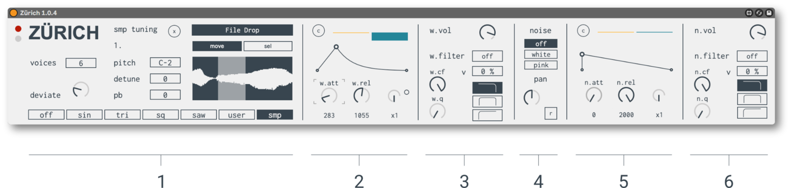




## PAGE UNDER CONSTRUCTION

**Title**  dsfadfasdfsdfadfdsffads

---

## SYSTEM REQUIREMENTS

Zürich was built with Max 8.1.10. & recommended for Live 11.
[License Information](/license)

### Photo Credits

Thumbnail photo from the museum [Pavillon Le Corbusier](https://pavillon-le-corbusier.ch/en/)


