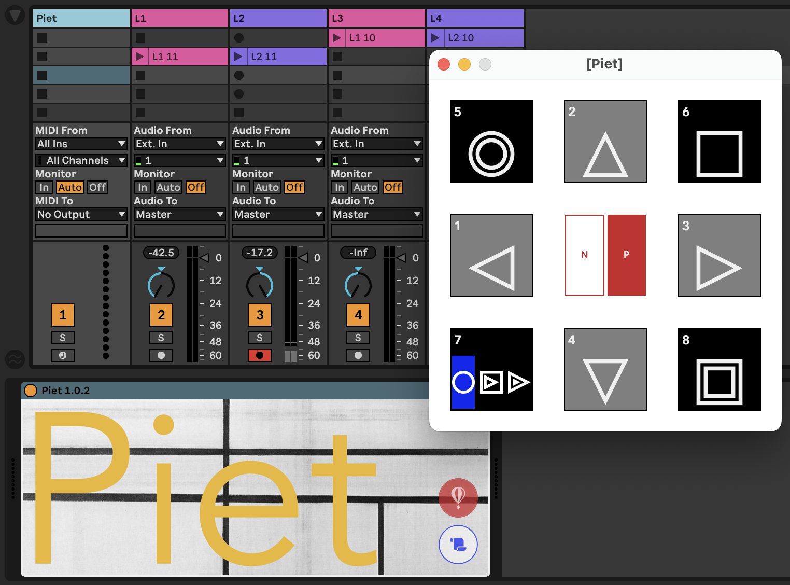
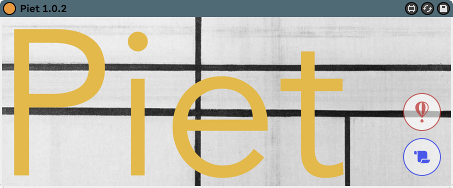
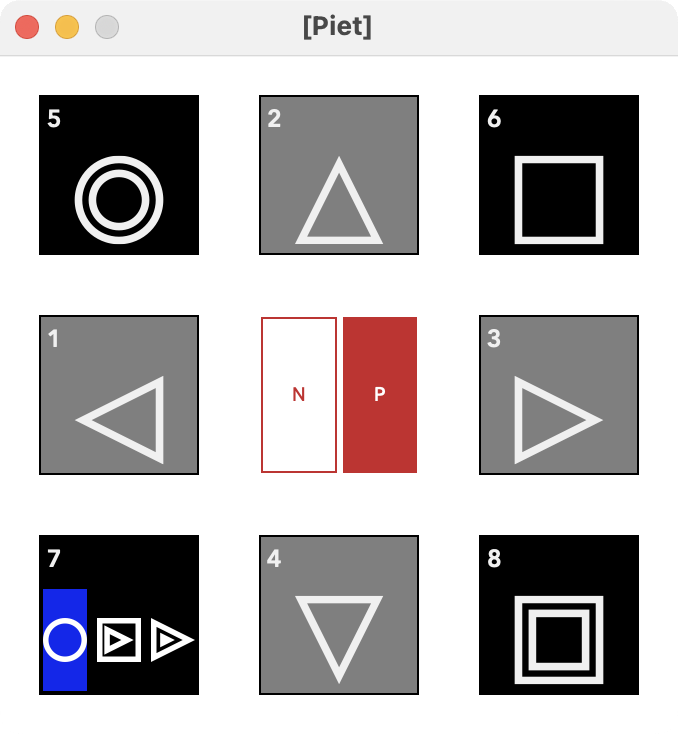



**Piet** Piet is a Max for Live Device that can help the user navigate through the session clips and control their transport individually or collectively via MIDI note or program assignments.
<!--  -->
## OVERVIEW

Because Piet is meant to move through your clip selection vertically across scenes and horizontally across tracks, all the navigation controls are located in a floating window.

First you should load the .amxd device onto an empty MIDI track...

On the main device you'll find two buttons: the Floater Button which opens a floating window, and a Help button that takes you to this website. 

Let's look at the floating window which has all the controls...

---

## System Requirements

M4L devices built with Max 8.1.10. & recommended for Live 11.
[License Information](/license)




