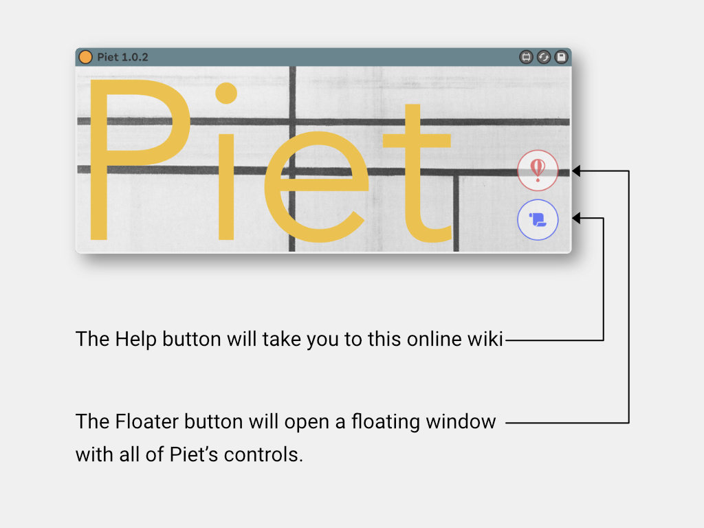



**Piet** Piet is a Max for Live Device that can help the user navigate through the session clips and control their transport individually or collectively via MIDI note or program assignments.
<!--  -->
## OVERVIEW

First you should load the .amxd device onto an empty MIDI track...

Because Piet is meant to move through your clip selection vertically across scenes and horizontally across tracks, all the navigation controls are located in the floating window.

Let's look at the floating window which has all the controls...

There are nine controls in total – some are straight buttons, some are taps with a number of choices...

- At the center you can switch between MIDI note assignments and program changes.
- The arrows labeled 1-4 will help you navigate your clip slot selection:
    - Pressing left (1) or right (3) will move your selection horizontally across tracks.

    *Note*: Automatically, the track that's selected will be record-enabled.

    - Pressing up (2) or down (4) will move your selection vertically across scenes.
- The top-left button (5) will fire a clipslot: 
    - If the slot is empty, this action will start recording a new clip. Pressing the fire button a 2nd time will stop recording and immediately start playing the new recording (depending on your global quantize settings).
    - If there's a clip already on that slot, pressing the fire button will just play that clip.
- The top-right button (6) will stop the selected clip.
- The bottom-right button (8) will stop all clips.
- The bottom-left button (7) will change how the fire button behaves – there are three choices:
    1. The fire button will act independently on each selected clip.
    2. The fire button will stop any previously playing clips and start recording/playing the selected clip.
    3. The fire button will start the selected scene altogether.

- The numbers on the top-left corner of each square reflect either program change or MIDI note assignments for each control. These can be mapped to any desired number from your hardware controller.

---

## System Requirements

M4L devices built with Max 8.1.10. & recommended for Live 11.
[License Information](/license)




