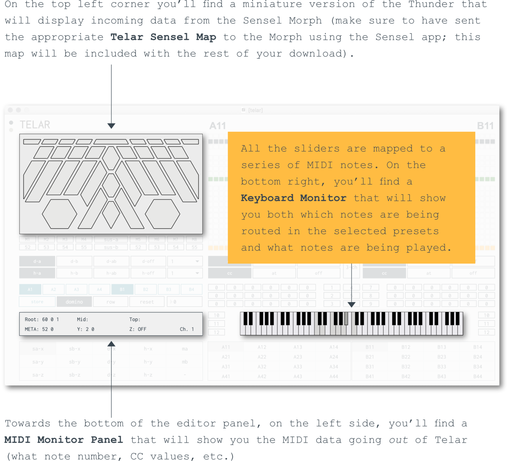

<!--  -->
<!--  -->


**Telar** is a dynamic MIDI mapper for [Sensel Morph’s Thunder Overlay.](https://morph.sensel.com/pages/buchla-thunder-overlay)
Thunder’s controls are split into a simple symmetric setup and an intuitive structure.
It also features a sophisticated preset system, designed with live performance in mind. 
Each slider can be mapped to any one note (or chord), XYZ control and MIDI channel. 
Telar comes as a suite of Max for Live devices (a standalone app is also in the works, see video below).




## HOW DOES TELAR WORK

The Sensel Morph, with the Thunder Overlay, is connected to a MIDI track in Live, with an instance of Telar. Another MIDI track (or set of tracks) will hold an instance of the Telar Bus device, which is responsible for sending the corresponding MIDI out. The outgoing signal can be fed into an instrument in Live (it also works with MPE if you use inter-application MIDI communication), or an external MIDI output; Telar also comes with a suite of additional devices that allow you to convert MIDI control data or apply remote mappings so that you can control any parameter in Live.

## THE TELAR SUITE OF M4L DEVICES

In addition to the main Editor and the Telar Bus, you also get a couple of CC Mappers and a CC Converter (which allows you to transform an incoming control signal – as CC data, Pitch Bend or Aftertouch – into anyone of those three types.

## WHAT CAN IT DO?

The dynamic mapping capabilities of Telar provide a kind of modular routing ecosystem, so you can adapt the controller as your imagination sees it fit…

- You can, of course, have the whole of Thunder control one instrument.
- You can also split Thunder in two halves, so the left controls one instrument and the right controls another.
- You can have each slider in Thunder control its own sound/instrument (want to play a 12-piece orchestra? That might be possible!).
- You can have one hand play two instruments or sound sets, while the other hand mixes and adjusts parameters.
- The built-in preset system allows you to quickly change pitch sets for all the sliders in Thunder (you can have each of the available 32 presets play a specific chord set or scale).
- Each slider can transpose its assigned note up or down an octave; it can also play chords.

## A COMPREHENSIVE MONITORING SYSTEM

## A SOPHISTICATED PRESET SYSTEM

---

## System Requirements

Telar was built with Max 8.1.10. & recommended for Live 11.
[License Information](/license)




