<!--  -->


A sample-playback instrument that creates textures based on fragments of your waveform(s). The magic of this particular instrument lies just between traditional sample-looping and the ‘micro’ sound of granular synthesis – **Traces** rests on neither extreme and yet it brings a glimpse of both: the vibrating, pulsating rhythm of fragmented audio.

Traces offers ample ways to manipulate the envelope & rhythm of each audio fragment – or grain – as well as the ability to dynamically scan through your waveforms. It features four independent buffers, each with its own grain envelope and sequencer, and a Sallen & Key analog-modeled filter built by [Surreal Machines](https://www.surrealmachines.com/), and the ability to directly control most parameters via MIDI or Live’s remote mapping & automation.





## OVERVIEW

**Traces 2** is made up of four panels, the first two providing all the main controls. On the first panel you can load up to four audio files that you can play with. You can scan through the waveforms, pan each voice, adjust the overall AR envelope and filter. You also get many nifty visual aids to show you ‘where’ your sound is playing.

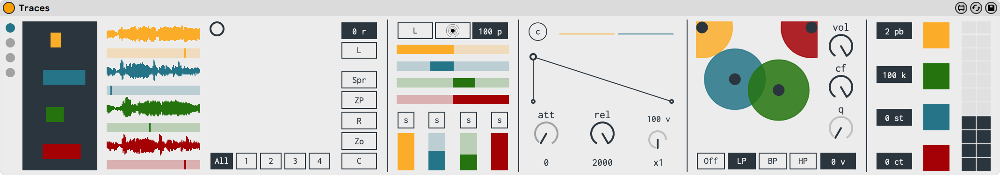

The second panel gives you all the rhythmic controls for each voice: a grain envelope and a dedicated sequencer.

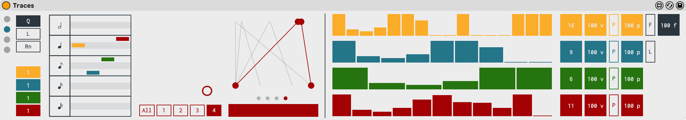

The third panel provides all the MIDI CC routing and mapping options.

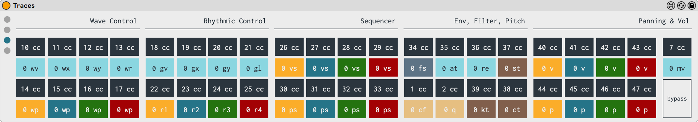

The fourth panel provides a number of links with additional information related to Traces.

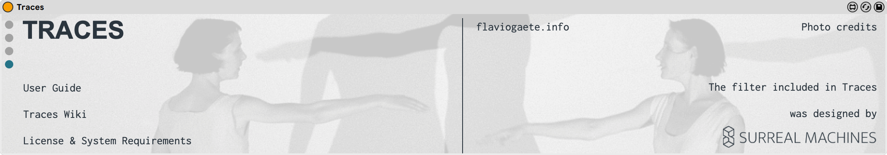

The Main Panel is divided into six sections…

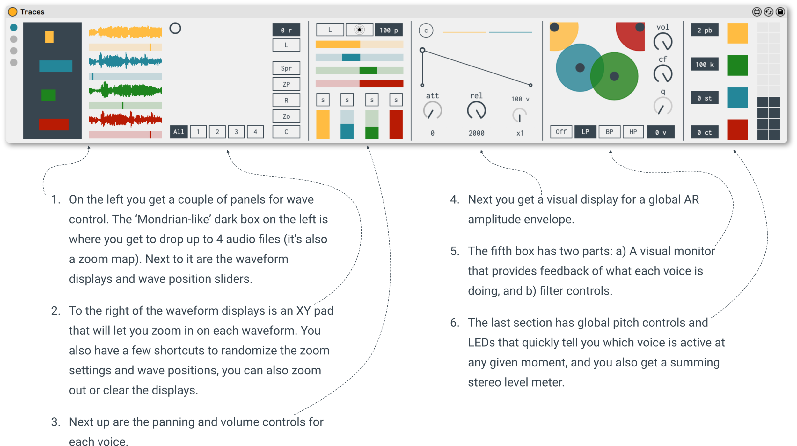

The second panel is devoted to all the rhythmic aspects of your sound. It’s divided into three general areas...

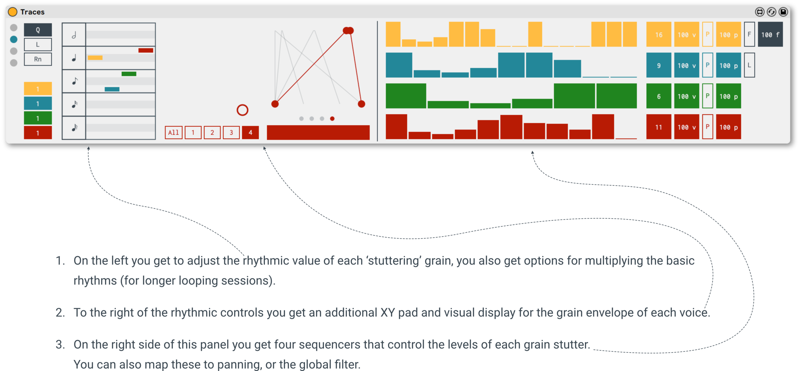

## POLYPHONIC VS. MONOPHONIC CHARACTERISTICS OF TRACES

Before we move on describing each component in Traces, we should take a look at how they’re all put together...

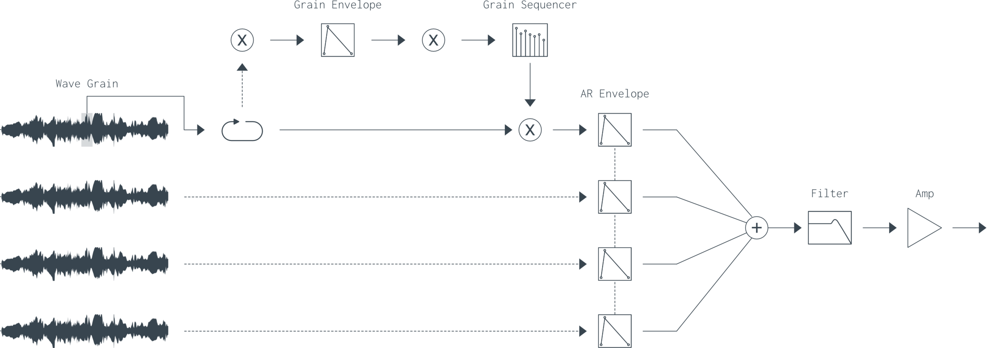

In terms of the sound generating engine, Traces may be considered a 4-voice polyphonic sample-playback instrument. Each voice is made up of a stereo sample buffer, processed independently (a section of the waveform is scanned, looped and then each loop – **or grain** – is passed by a Grain Envelope, then by a Grain Sequencer, giving each repetition a  potentially different volume.

All the voices pass through a (polyphonic) AR Envelope, and then are summed into a stereo bus, which then passes through a filter & amplifier.

Some of the components will be treated independently (e.g. the scanning of each waveform, its pan position, etc.), and some will be treated together (e.g. the filter will affect all four voices, as they’re summed before the are processed by it).

## POWERFUL WAVEFORM MANAGEMENT

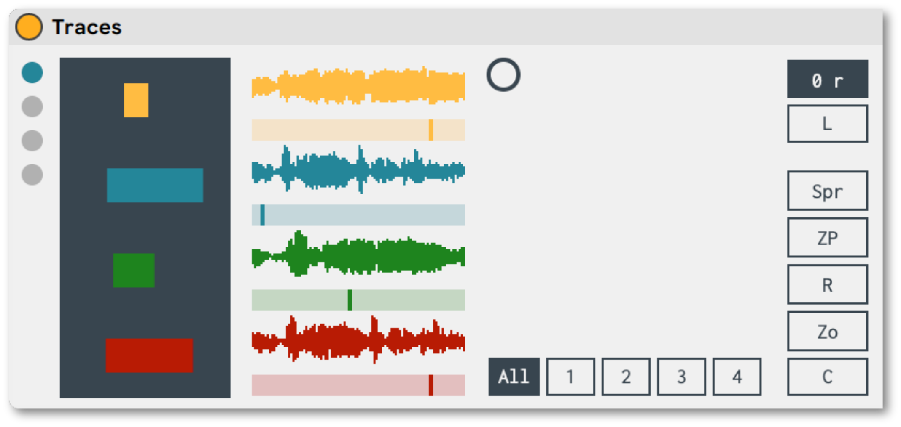

This new version of Traces features 4 independent, stereo buffers. You can load a different audio file on each, or have all the buffers play the same file, as you wish.

The Waveform Displays now can be zoomed in, with the ability to focus on really small sections of your waveform. There’s a dedicated XY Pad that will help you quickly navigate around your waveform(s) and you’ll get an overview of where you are on the waveform (the darker box on the left-hand side).

You can scan through the Waveform Displays (together or independently) and immediately hear the results, and you can also randomize (either or both) the various zoom settings & wave Position Sliders.

## DEDICATED PANNING & VOLUME

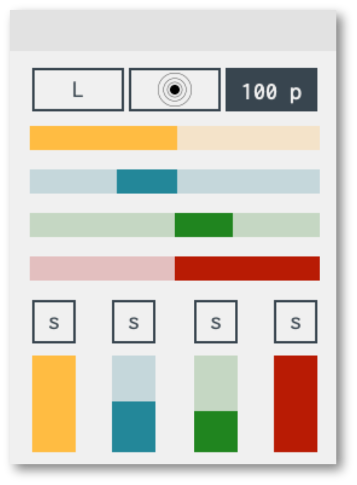

You can quickly spread your voices across your speakers, and the pan position of each voice can also be randomized in a number of ways. Having separate panning & volume controls provides independent placement and control of your sound.

The Volume section also features solo buttons, so you can quickly focus on a particular voice when working with complex textures.

## A NEW ‘AR’ ENVELOPE

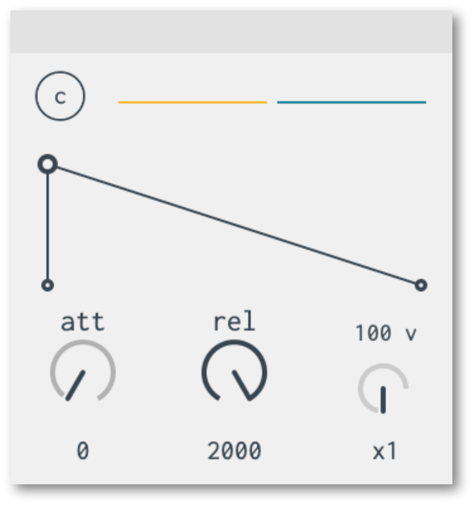

The overall amplitude envelope has been redesigned, with a cleaner visual display and more powerful controls.

You can quickly adjust the curves for each stage and the time range on each can be expanded up to 8 seconds.

## VISUAL MONITOR & FILTER

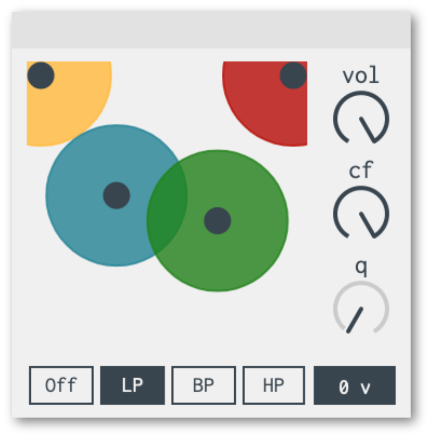

The filter controls are now split into independent (bigger!) knobs, and the filter now has a true bypass mode (saving on CPU real estate).

There’s also a Visual Monitor that shows you what’s happening with each voice (the X axis shows you the respective pan positions, the Y axis the current volume, and the diameter of the circles represents the rhythmic value of each grain being played).

## GLOBAL PITCH & LEVEL METERS

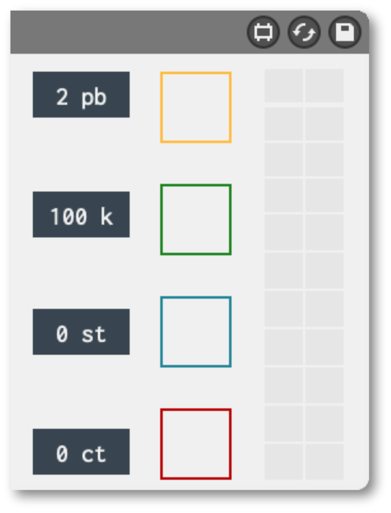

The pitch engine has been redesigned from the ground up, now offering true algorithmic scaling for a properly equal-tempered keyboard layout (thou you can still apply Key Tracking for funky intonations, or play all your samples with the same pitch and use the wave position instead to add pitch variation to your sound).

Added too are pitch bend control (with an adaptable range of 48 semitones each way), and the ability to transpose and fine-tune your samples.

You also get a metering section with LEDs that quickly show you which voice is currently active and a stereo level meter for the output bus.

## RHYTHM CONTROLS

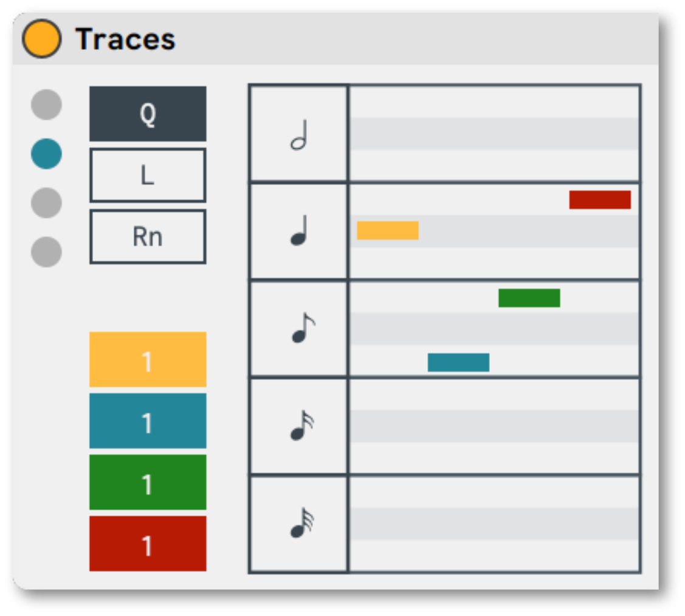

The Rhythm Sliders section has a couple of added features.

You can now randomize the rhythms with each incoming MIDI note.

The rhythmic value of each grain can now be multiplied 16 times over, giving you the ability to play really long ‘grains’ (a little over 8 bars for each voice), so you can come up with interesting ambient textures in addition to the more angular percussive sounds.

Because all four voices can be set independently of the other, you can come up with interesting poly-rhythms rather quickly (and poly-meters as well, as you’ll see further down below, in the new Sequencer section!).

## A BETTER GRAIN ENVELOPE

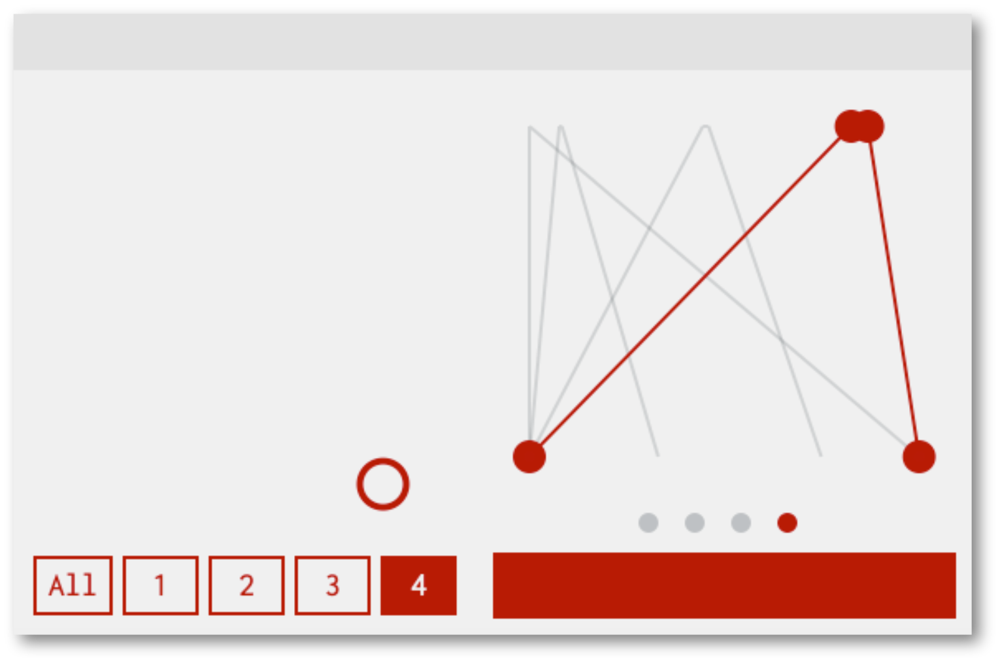

The Grain Envelope has been greatly improved as well.

The attack and release handles are more responsive and have been optimized for sound performance. The tremolos sound smoother, the glitchy stuff can be quite snappy as well. 

Each envelope is now independent of the others, following the rhythmic value of each grain.

## A NEW SEQUENCER SECTION

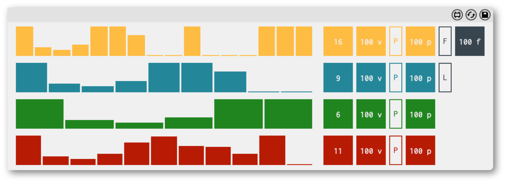

Each voice in Traces features an independent sequencer, which will manipulate the volume of each grain loop iteration with each step that it plays.

All 4 sequencers can be controlled in tandem, or they can work independently of each other – each on its own length and step values.

Additionally, they can be mapped to the Pan Sliders, and the first sequencer can also be mapped to the filter’s Cutoff Frequency (keep in mind that the filter is placed after all the signals have been summed to a stereo bus).

All the controls in each sequencer can be scaled independently.

---

## MIDI ROUTING & REMOTE MAPPING

All the major parameters in Traces can be directly mapped to incoming MIDI CC data & are also available to Live’s remote mapping and automation.

Below is a list of all the parameters that are available:


Wave Control


•	Wave Voice.

•	Wave Controls X-Slide (horizontal zoom position).

•	Wave Controls Y-Slide (zoom amount).

•	Wave Position Random Trigger.

•	Position Sliders 1 - 4.


Rhythmic Control


•	Grain Envelope Voice.

•	GE Controls X-Slide (attack & release times).

•	GE Controls Y-Slide (envelope width).

•	GE Release Length.

•	Rhythm Sliders 1 - 4.


Sequencer


•	Volume Scaling 1 - 4.

•	Pan Scaling 1 - 4.

•	Filter Scaling.


AR Envelope


•	AR Envelope Attack.

•	AR Envelope Release.


Pitch


•	Global Pitch Transposition.

•	Global Pitch Fine Tuning.

•	Key Tracking.


Filter


•	Filter Cutoff Frequency.

•	Filter Resonance.


Panning & Vol


•	Volume Sliders 1 - 4.

•	Pan Sliders 1 - 4.

•	Main Volume.

---

## SYSTEM REQUIREMENTS

This new version of Traces begins at 2.0.0.
It was built with Max 8.1.10. & works with Live 10 & up.

[License Information](/license)

## PHOTO CREDITS

FASE: Choreography by Anne Teresa De Keersmaeker.Dancers: Laura Bachman & Soa Ratsifandrihana; Yuika Hashimoto & Laura Maria Poletti; Anne Teresa de Keersmaeker & Tale Dolven.

Photos: Anne Van Aerschot & Jamie Williams/Sydney Festival.


