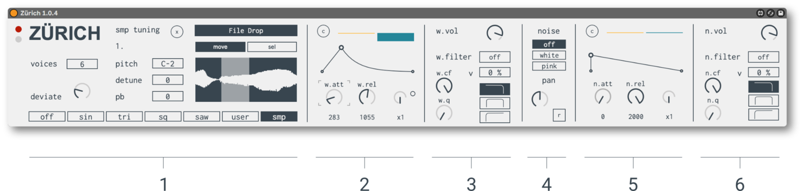
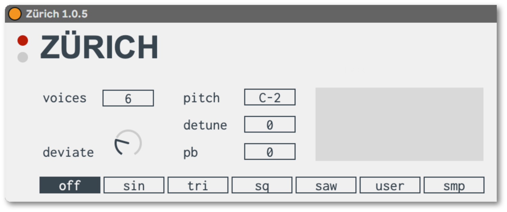
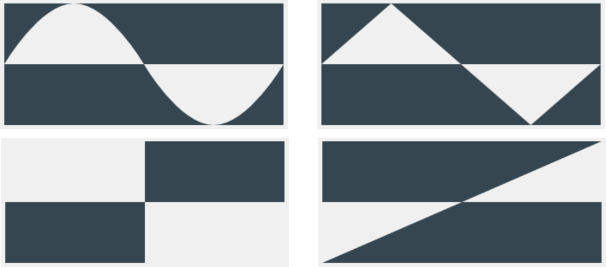
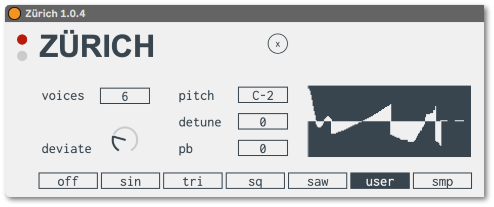
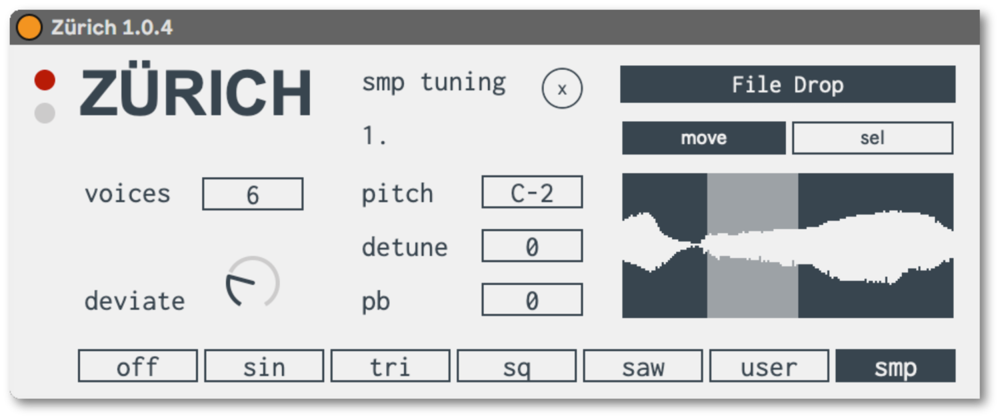
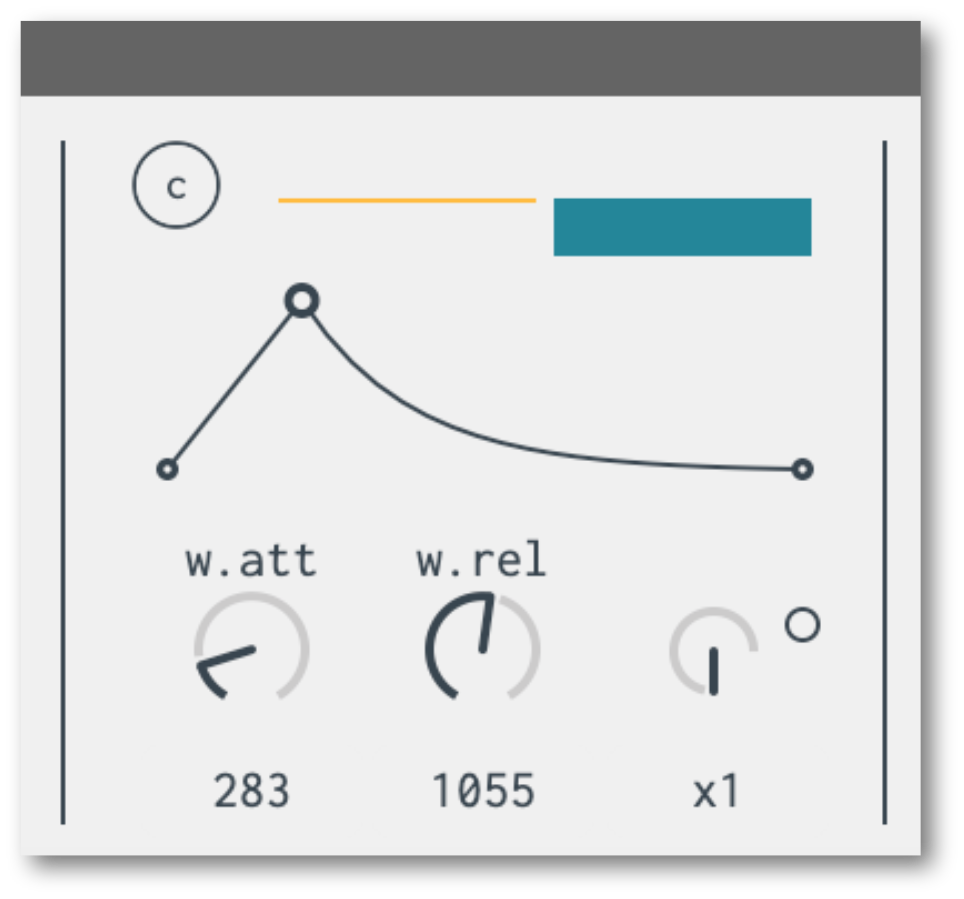
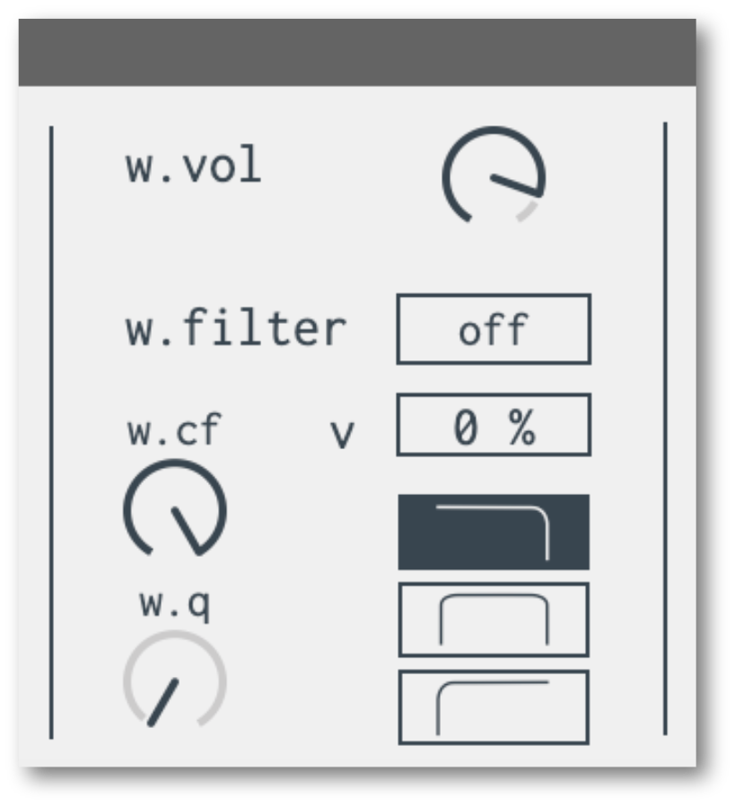
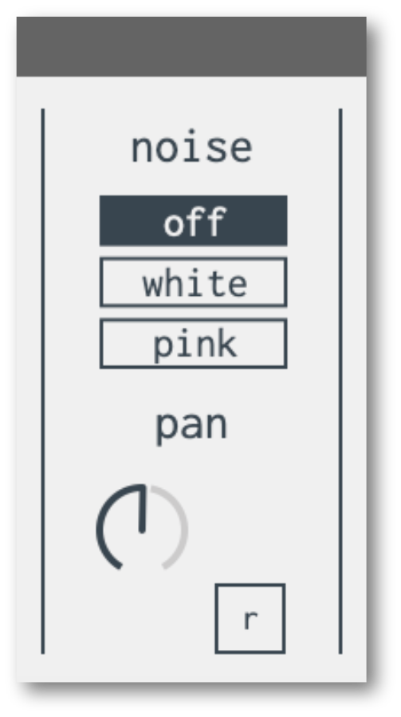
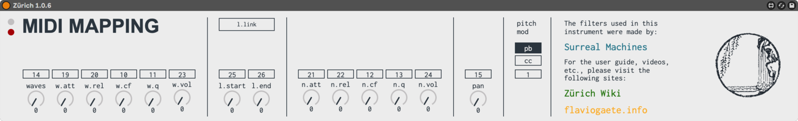

<!--  -->


## OVERVIEW

**Zürich** was designed as a day-to-day tool for generating standard synth waveforms & sounds. It also includes a noise generator with both white and pink noise, as well as dedicated AR envelopes and filters for each. The filters were designed by Surreal Machines (please see the last page for credit info).

Zürich is divided into six sections, roughly:
1. The Waves section: a bank of standard oscillators & sound generators. 
2. A dedicated AR envelope for the waves section.
3. A dedicated filter for the waves section
4. Noise generator options & panning
5. A dedicated AR envelope for the noise generator
6. A dedicated filter for the noise generator.

Embedded also are panning controls and a second page for MIDI mapping and automation (more on this at the end of this user guide).

## THE WAVES SECTION

The oscillator section features the following global controls:

- Voices: even though Zürich is a monophonic synth, each of the basic oscillators can play up to 6 voices.
- The Deviate control let’s you randomize the center frequency up to 12 Hz off its center.
- The Pitch control will let you monitor the incoming MIDI pitch.
- You can detune the basic pitch up or down by 100 cents.
- The PB control let’s you adjust the amount of pitch bend, up to 48 semitones.

The first four oscillator types provide the standard sine, triangle, square, and sawtooth waveforms:

The user waveform let’s you draw your own wave shapes. Simply click and drag with the mouse in the waveform monitor as you feel inspired. If you’d like to start over, just click on the X button above.

 The sampler waveform let’s you use an audio file as a sound source. You’re free to play the whole sample or loop a portion of it. 

- Drop your audio in the File Drop area. 
- Choose move to zoom and navigate around your waveform (vertical dragging zooms in and out, horizontal dragging moves the waveform left or right).
- Choose sel to select an area of your waveform that you wish to loop.
- The X button in this case resets your loop selection and reverts to looping the entire sample.

---

## THE AR ENVELOPES

The standard attack and release controls feature a time range from 0 - 2000 milliseconds, which can be multiplied up to 4 times (for a total of 8 seconds each).
Each stage can be curved up or down with the colored dual-slider above.
The C button clears the curves.
In addition, both envelope generators (for the waves and noise sections respectively) can be linked together by clicking on the small dot next to the time expander knob.

## FILTERS & VOLUME CONTROLS

Each sound generator (waves & noise) passes through a Sallen & Key filter (designed by Surreal Machines, more info at the end of this user guide), with the following controls:

- Filter Type: choose between low pass, band pass and high pass.
- Cutoff Frequency.
- Resonance (Q).
- Velocity Modulation Amount.

Also, each sound generator has its own volume control.

## BYPASS

Additionally, each section in Zürich can be turned on or off, which also engages or disengages the CPU accordingly, for that particular audio network.

## NOISE TYPE & PANNING

The noise generator can provide either white or pink noise.
The pan control affects both sound generators simultaneously.
The R button randomizes the panner with each Note ON trigger.

---

## MIDI MAPPING & AUTOMATION CONTROLS

There’s a dedicated page in Zürich for organizing MIDI mapping and automation. The following controls can be directly assigned to MIDI CC data or mapped using Live’s remote mapping:


WAVES


- Wave type
- AR Envelope: attack & release
- Filter cutoff frequency and Q.
- Volume


SAMPLER WAVEFORM


- Loop start
- Loop end
- Link loop start & end positions.


NOISE


- AR Envelope: attack & release
- Filter cutoff frequency and Q.
- Volume


GLOBAL CONTROLS


- Pan
- Pitch control type (pitch bend vs. regular CC).

---

## SYSTEM REQUIREMENTS

Zürich was built with Max 8.1.10. & recommended for Live 11.
[License Information](/license)

### Photo Credits

Thumbnail photo from the museum [Pavillon Le Corbusier](https://pavillon-le-corbusier.ch/en/)


