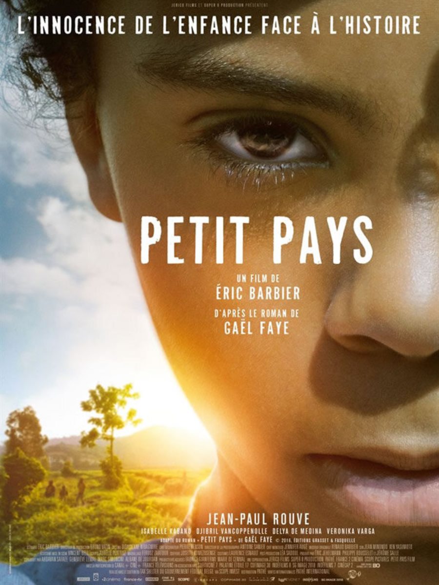
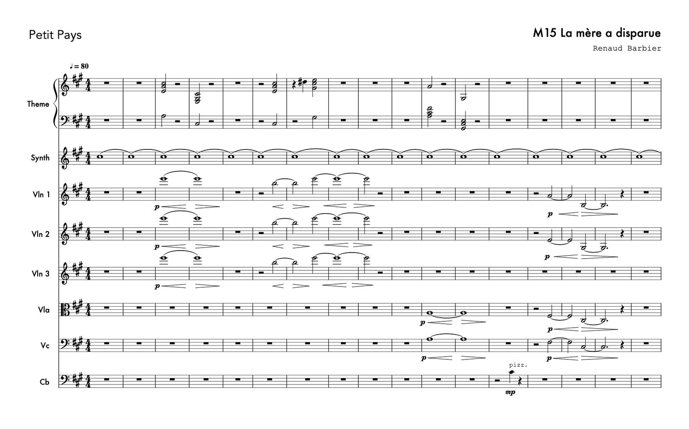
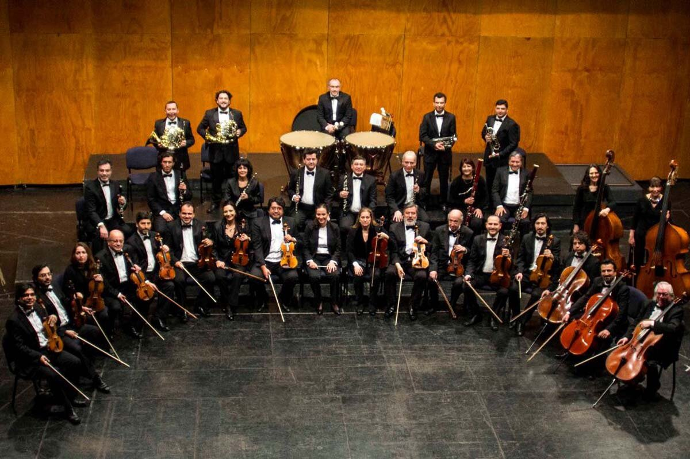
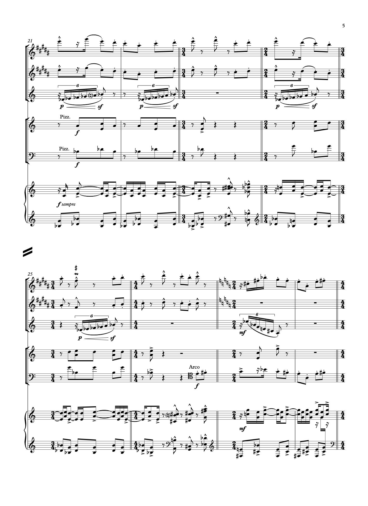
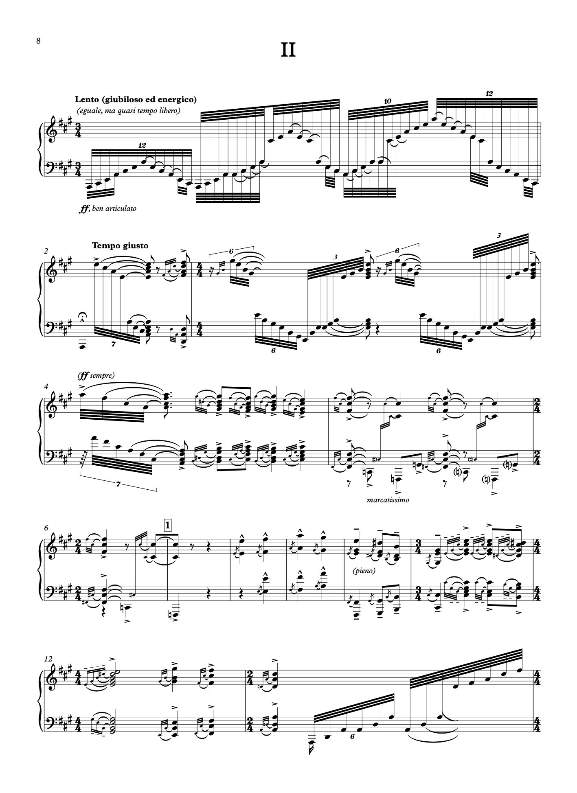
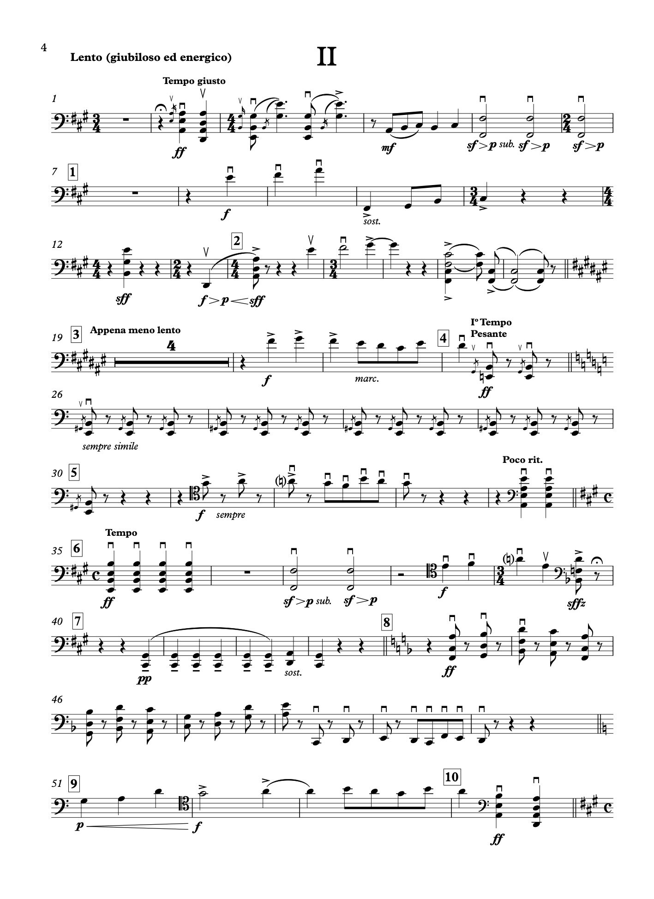
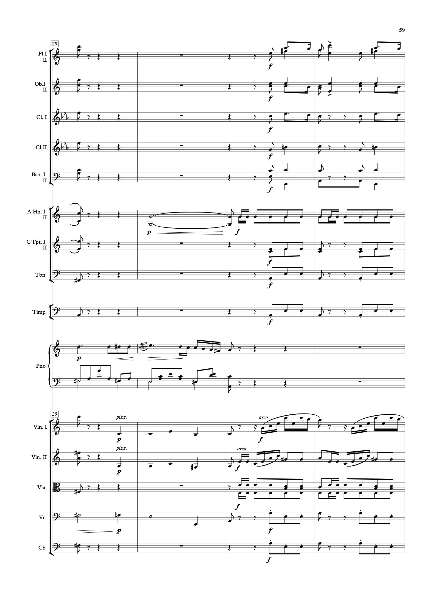
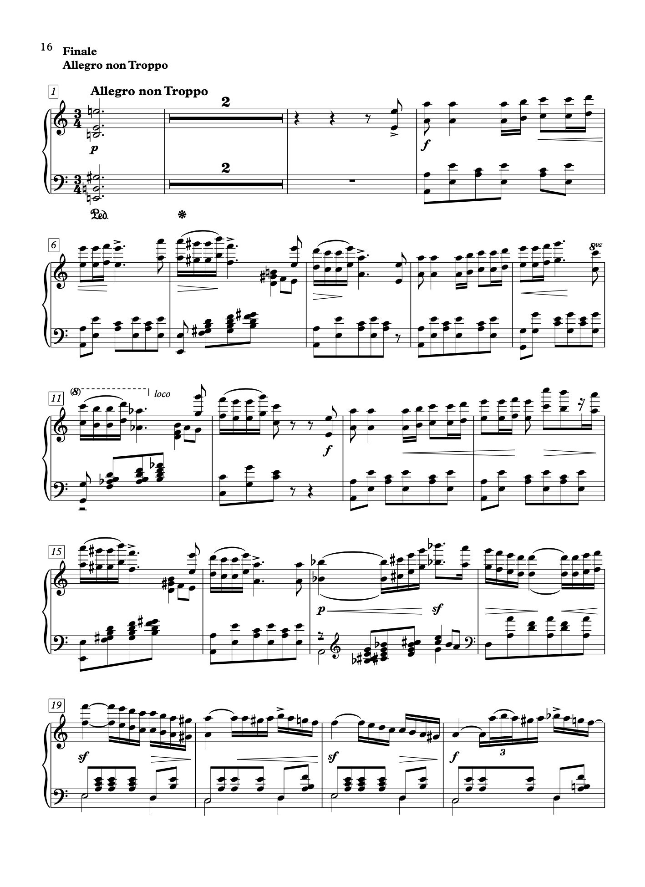
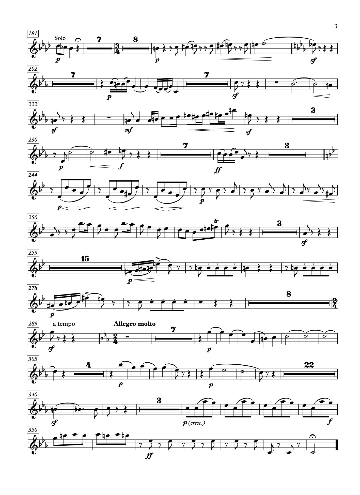
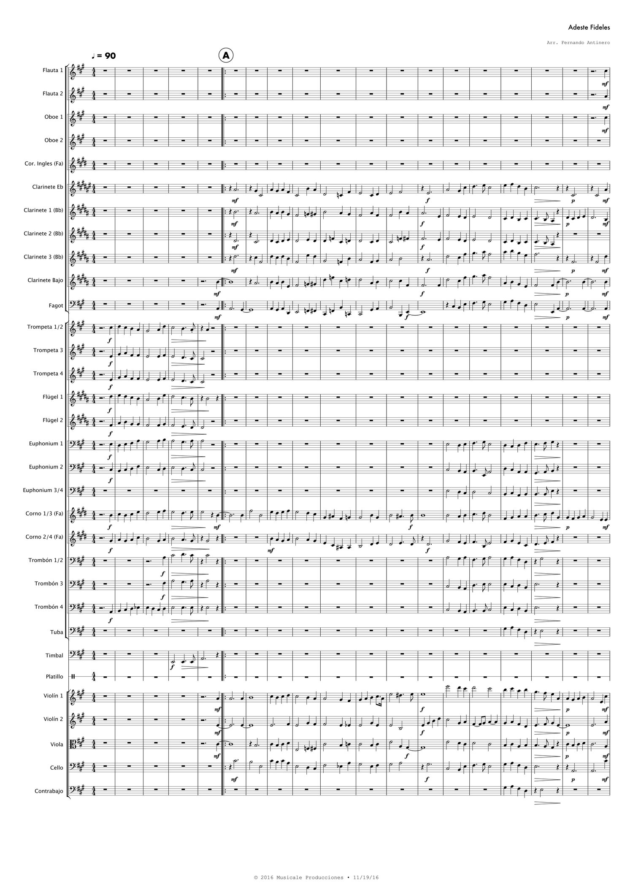



Over the years, I have worked in collaboration with a number of composers, orchestras and music production companies, doing music editing of orchestral scores (ranging from chamber ensembles to full symphony orchestras). I work mostly on Sibelius and Musescore (which I find quite powerful!).

Below you'll find a sample of the work I've done.

## RENAUD BARBIER | PETIT PAYS

In the fall of 2019 I collaborated with film composer Renaud Barbier on his film score for Petit Pays (Small Country). I worked both as a copyist, generating all the parts and scores from his MIDI files, and I also performed as a violist, as part of the recording ensemble (it was quite an honor to have had the opportunity to record in the same studio where Jacques Demy and Michel Legrand worked on Les Demoiselles de Rochefort!).




Here's a sample of one of the music cues that I edited:



---

## ORQUESTA DE CÁMARA DE CHILE

While I was living in Santiago, I got to work on the archives of the [Orquesta de Cámara de Chile.](https://www.cultura.gob.cl/orquesta-de-camara/) I was commissioned to transcribe a few scores for them (for the conditions were quite adverse for the ensemble to get hold of some of the music – it was either too obscure, or because of slow bureaucracy, it was just prohibitive to get the rental parts in time from overseas).

Below you'll find samples of two large orchestral works (I had to come up with full new renderings of the full orchestral scores and parts).

## MANUEL DE FALLA | HARPSICHORD CONCERTO

In this particular occasion, the work was so large and the time frame so short, I was lucky to team up with fellow composer [Ignacio Perez Marin.](http://ignacioperezmarin.com/)

Sample of the orchestral score:

Sample of the solo harpsichord part:

Sample of the cello part:

## CLARA SCHUMANN | PIANO CONCERTO

For this piece, we were going to work together with a great German publisher, [Furore,](https://furore-verlag.de/en/start/) which focuses on the works of women composers. Unfortunately, the timeline didn't work out (the orchestra depends on the public moneys that just weren't going to be approved in time). They were super generous to provide us with a score. Below is a sample (please contact them if you're interested in renting the parts).

Sample of the orchestral score:

Sample of the solo piano part:

Sample of the clarinet part:

---

## MUSICALE PRODUCCIONES

I got to work for Musicale Producciones for a Christmas concert they organized in Chile, 2017. Here's a small sample of their work:

