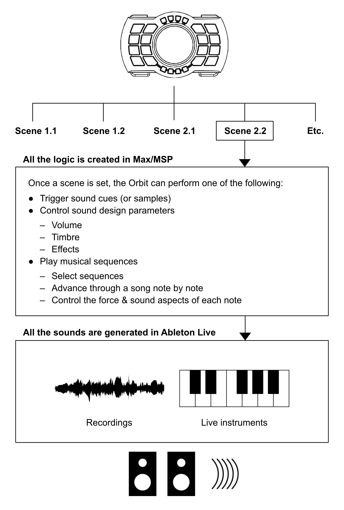
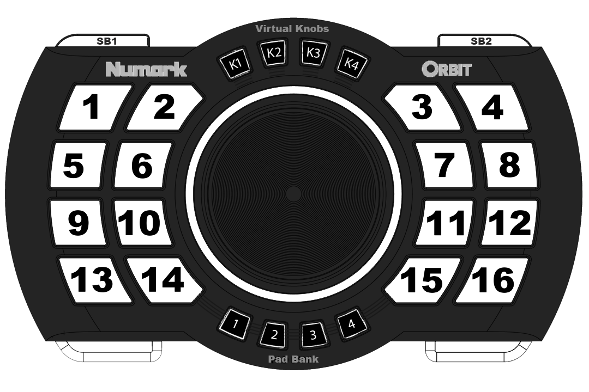
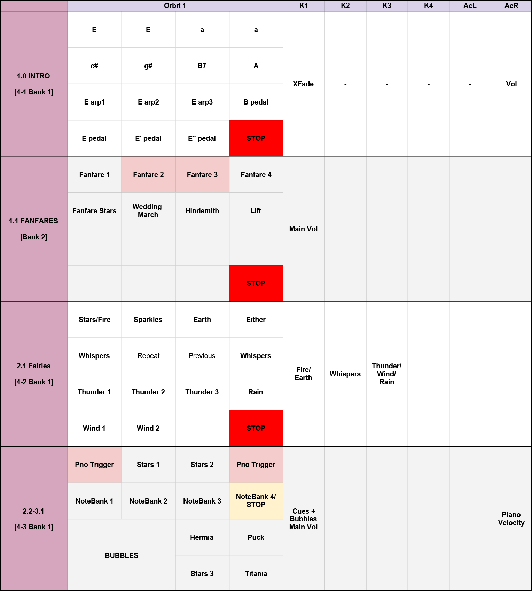
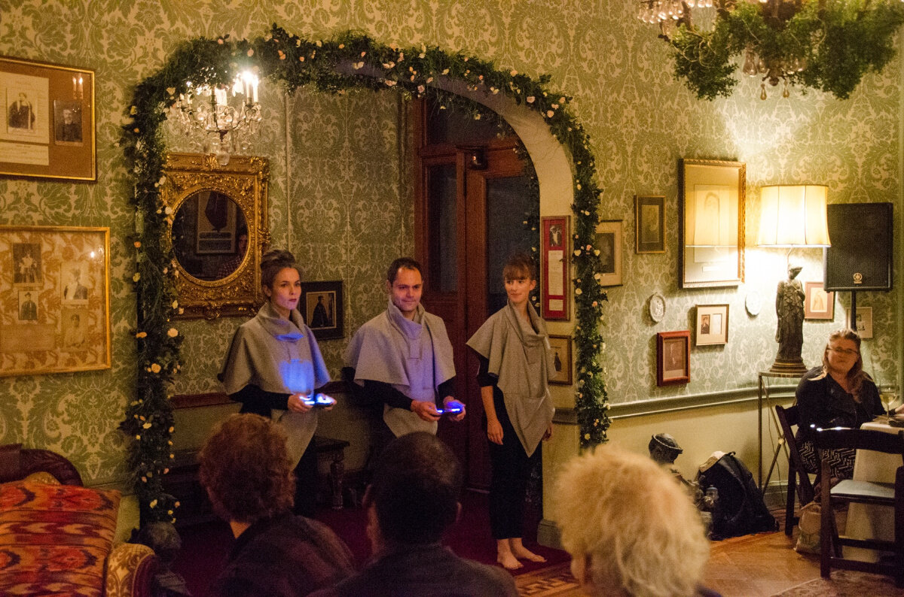
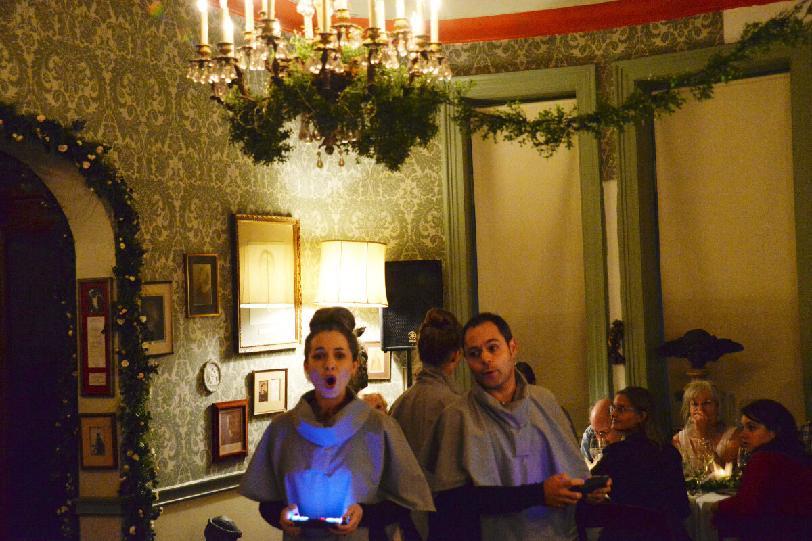
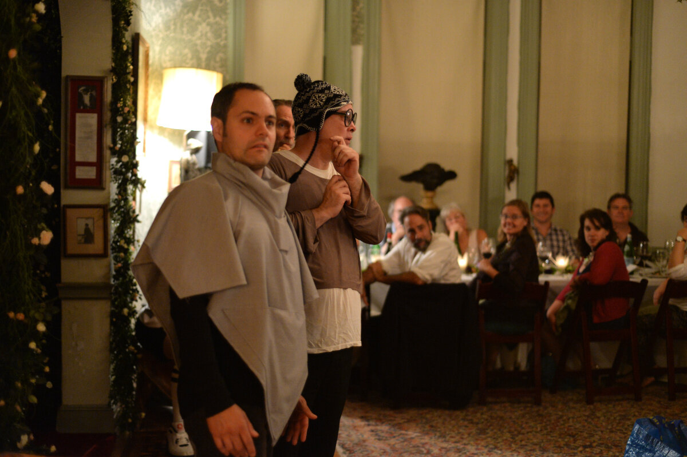
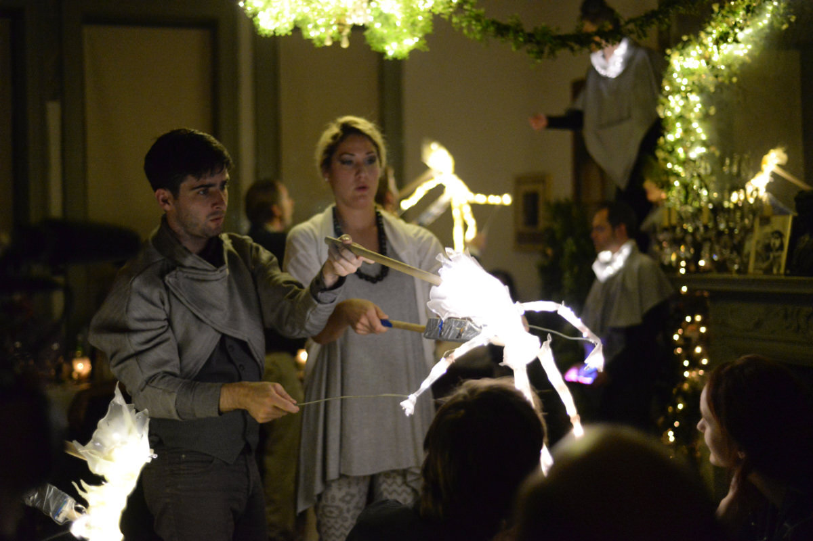
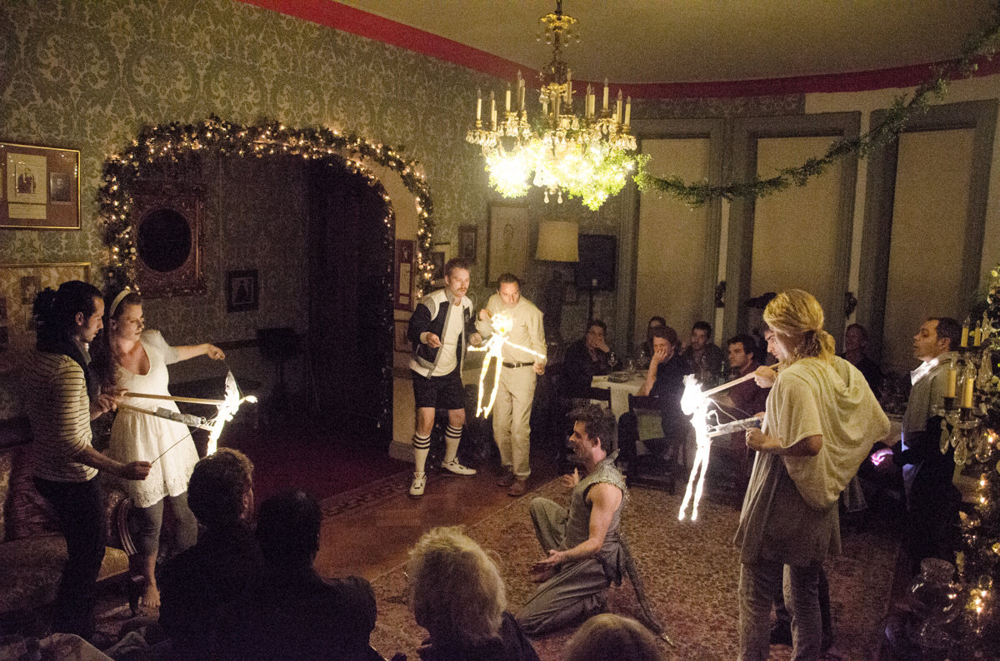
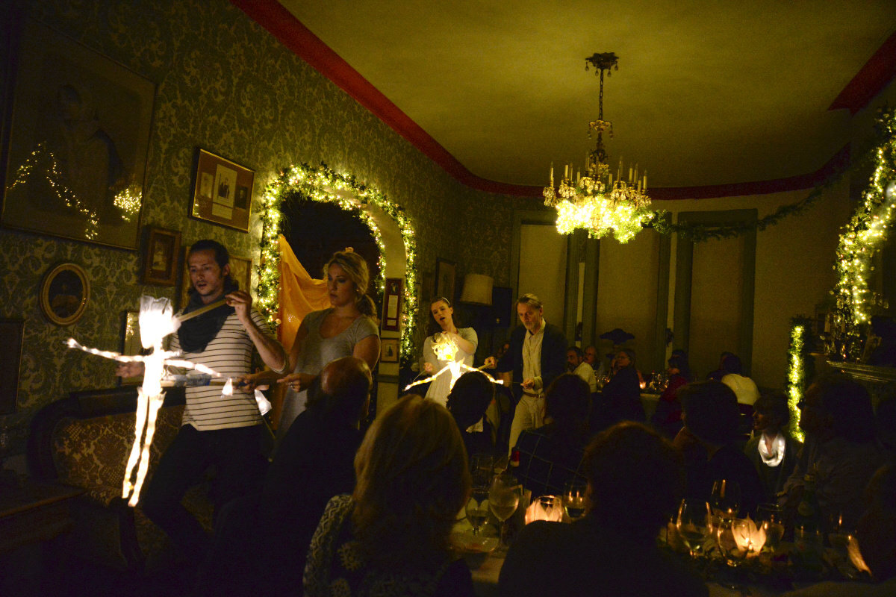
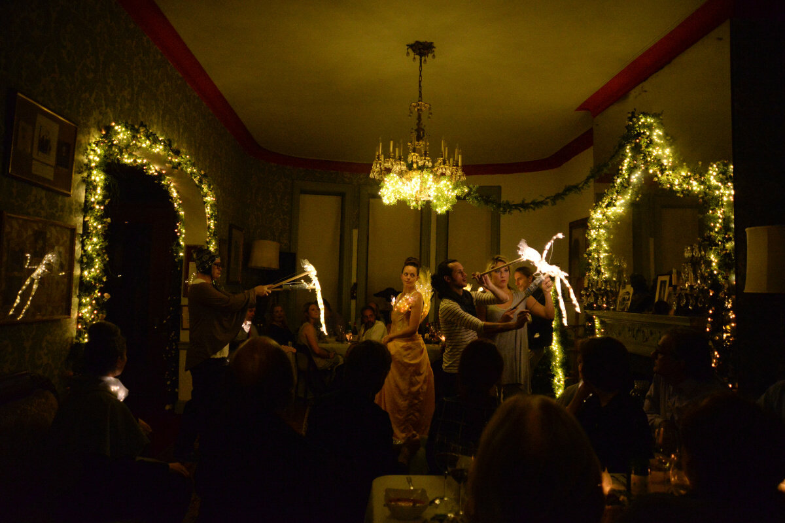

# INTRODUCTION
This is a production I worked on in collaboration with [New Place Players,](https://newplaceplayersnyc.com/) a Shakespeare theater company based in NYC, which was performed in NYC from 2014 to 2016. I was working for the company as Music Director. For this particular production I did a variety of work, which I’ve divided into three general areas. But first, let's start with a brief slideshow (2 min. approx.) with photos and music from this production (you'll hear, in addition to my own music, a few samples from Damon Albarn, and Hindemith):




## LIVE SOUND DESIGN

First, let's look at the **Live Sound Design System** I devised, so that: a) any actor or musician on stage could have direct control of the sound and music cues, via a wireless remote controller, and b) any music or ambience or sound effect could be changed in real time, following the natural progression of the scenes as they were acted.

This involved creating a prototype system for performing music and sound design cues in real time, created with Max/MSP and Ableton Live and programmed around Numark’s [Orbit wireless DJ controller.](https://www.numark.com/product/orbit) Below is an explanatory video (3 min. approx.):





This sound design project started with the idea of the **spirit of the Fairies** existing inside a sound world (for an overview of the play, click [here](https://en.wikipedia.org/wiki/A_Midsummer_Night%27s_Dream)): that their doings and charms and tricks would occur in the sound/music domain, so to speak. So, for example, with a finger snap, ‘other-worldly’ sounds would surround the spirits’ subjects and envelop them with their magic.

Initially, I envisioned the actors using special ‘wearable’ sensors, for example, a special ring or gloves, or sensors attached to their clothing – an idea that I didn’t get to realize on this first round of the production, but which I think is still worth pursuing. At any rate, in the process of developing these ideas for the play, the director came up with **Indonesian-style puppets** that were to be played by the actors playing the fairies; all along I was in charge of following their actions with sound and music, live...

While doing my research, I learned about Numark’s Orbit, a wireless DJ controller, which proved to be a welcome prototype, for the following reasons:

- **It comes with a wireless system**, (which is Wi-Fi independent) and it is small and portable: an actor or performer could use it while moving relatively free onstage.
- **It features 16 programmable buttons**.
- It has a large knob that can be programmed to that **it can control various parameters**.
- **It has an accelerometer** that works over two axis points: vertical and horizontal; they can provide two additional independent controls that are quite responsive to broad body movements.

I programmed the Orbit using the following logic: The wireless controller is connected to a **Max for Live device**, which then routes commands to various tracks in Ableton Live (the latter storing all the variety of sounds and instruments used in the play).

To start, there is a **meta** layer that specifies which act or scene is currently active (each scene has its own set of sound and music cues to be triggered or performed).

Then, depending on the scene, there are various **categories** of sound that are controlled:

1) Standard sound cues may be triggered.
2) Various layers of sound may be triggered at the same time, with various degrees of control as to how they will be performed:
- Volume
- Brightness
- Wet/Dry mix of special effects
3) Musical sequences may be controlled in various ways.

Here is an overview of the device itself: it has 4 banks (the **Pad Bank** black buttons 1 - 4 at the bottom of the device); each bank has its own set of sixteen buttons (the white buttons labeled '1 - 16'). It has a volume wheel in the center, which can control four different parameters (by selecting the **Virtual Knobs** buttons K1 - K4 at the top), and two buttons ('SB1' & 'SB2' at the very top) which activate the accelerometers (horizontal and vertical respectively).

Here is an excerpt of the control map for the 16 buttons, plus volume controls (K1 - K4) and accelerometer buttons (left and right), and what they’re programmed to perform in each particular scene:

For example, in **Scene 1.1**, eight of the sixteen white buttons have been programmed to trigger various sound cues:

- (From left-to-right / top-to-bottom) Buttons 1 - 5 will trigger various “trumpet fanfare” sounds.
- Button 6 will sound Mendelssohn’s Wedding March from his A Midsummer Night’s Dream orchestral suite.
- Button 7 will sound an excerpt from Hindemith’s Symphonic Metamorphosis.
- Button 8 will trigger a sound cue.
- Button 16 will stop any sound that’s currently playing.
- The volume control controls the volume for any of the sounds.
- The accelerometers in this scene don’t do anything

In another example, **Scenes 2.2 through 3.1** have been mapped into three sections:


SECTION 1


- Buttons 1 and 4 will advance a piano sequence.
- Buttons 5-8 choose from 4 different note sequences.
- The right accelerometer button will change each note’s intensity (velocity).


SECTION 2

- Buttons 2, 3, 11, 12, 15, 16 trigger a variety of sound cues for various characters and situations.


SECTION 3

- Buttons 9, 10, 13, 14 play different randomized "bubble-like" textures (the four buttons are grouped together).
- Here’s a screenshot of Ableton Live’s sampler, hosting the set of sound cues for scene 1.1:

Well, so much for a general overview of the system. I hope the video gave you a good idea of how the whole system works. Moving then to a few actual sound design examples...

---

## SOUND DESIGN AND MUSIC EXAMPLES

Perhaps it's better if you watch this short video first (4 min. approx.), to get a sense of how the sound design and music elements fit in the context of the live performance:





Now we can focus on the sound world directly. We start with the world of the Fairies. This soundtrack is a mix of sound design and music. It's placed around the Fairies & Puck, when they foresee trouble ahead as Oberon and Titania are about to discuss away their conflicts. Titania will predict that without their harmony, the whole world and all its elements (earth, water, fire, air) will go into disarray. The sound begins with the surrounding universe and all its comets and planets and asteroids, as they fly by our planet Earth in this cosmic event!

Here are a number of audio examples of sound & music cues that occur throughout the play. You can start with the 2nd cue, *Earth*:





A good part of this music is really rearrangements and citations inspired by <a href="https://en.wikipedia.org/wiki/A_Midsummer_Night%27s_Dream_(Mendelssohn)">Felix Mendelssohn's</a> incidental masterpiece (especially the <i>Intro</i> and <i>Epilogue</i>, the latter using a a sample from the recording by Claudio Abbado and the Berlin Philharmonic). Some of the <i>Oberon</i> sound cues also use a sample from the track <a href="https://www.youtube.com/watch?v=jvh0IMKX9Q4"><i>Lift</i></a> by Love and Rockets, from their 1998 album (titled the same).


---

## PERFORMANCE GALLERY

